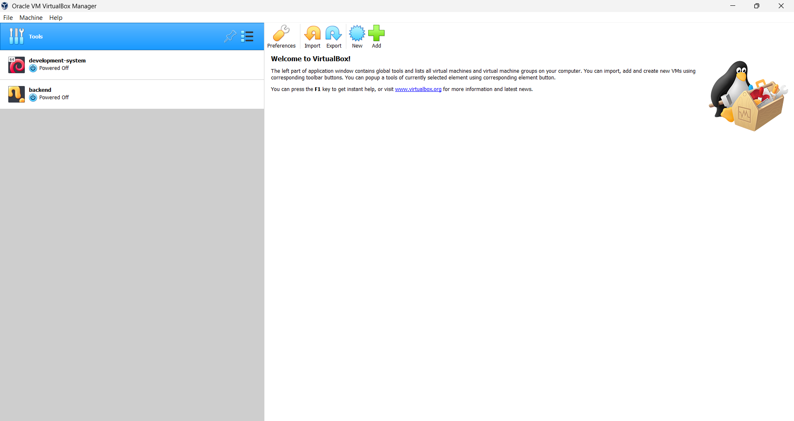
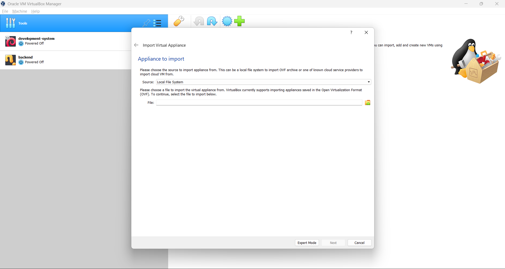
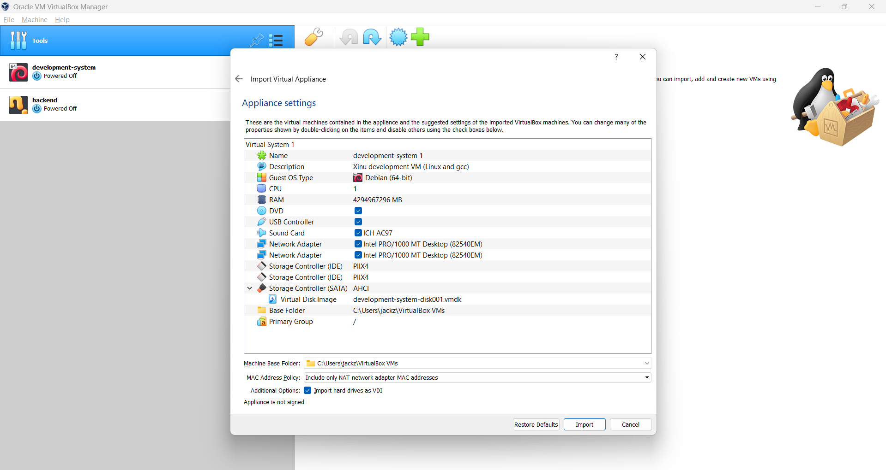
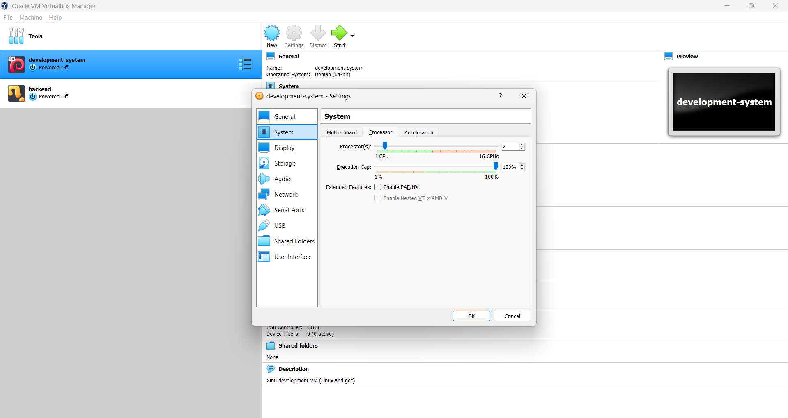
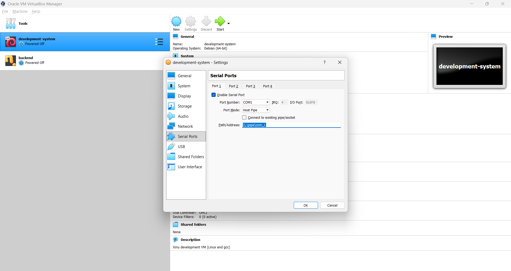
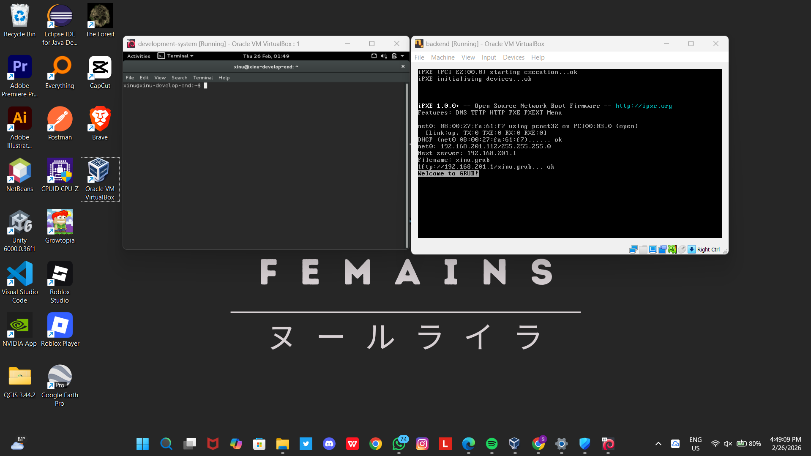

# <h1 align="center">Laporan Praktikum Modul 1   Running Modul</h1>

Salman Alfarisi - 2311104036

## Dasar Teori

Oracle VM VirtualBox adalah perangkat lunak virtualisasi yang memungkinkan pengguna menjalankan sistem operasi lain di dalam sistem operasi utama. Dengan VirtualBox, satu komputer fisik dapat memiliki beberapa “mesin virtual” (virtual machine) yang berjalan secara bersamaan.

Sourcetrail adalah perangkat lunak analisis dan visualisasi kode sumber (source code explorer) yang membantu pengembang memahami struktur dan hubungan dalam sebuah proyek pemrograman. Tools ini dirancang untuk memudahkan navigasi kode, terutama pada proyek besar yang memiliki banyak file, class, dan fungsi.

Ubuntu adalah sistem operasi berbasis Linux yang bersifat open-source dan gratis. Ubuntu dikembangkan untuk memberikan sistem yang stabil, aman, dan mudah digunakan, baik untuk pemula maupun profesional.

Xinu (eXtensible, Interoperable, and eXperimental UNIX) adalah sistem operasi sederhana yang dirancang untuk tujuan pendidikan dan penelitian. Xinu dibuat untuk membantu mahasiswa dan peneliti memahami konsep dasar sistem operasi secara langsung melalui implementasi kode sumbernya.

## Guided

lakukan hal yang sama pada file Backend
kemudian pada Development-system tekan setting
lalu cari system, klik processor kemudia bagian cpu ubah menjadi 2

kemudian pada display centang Enable 3d accelartion

kemudian pada serial port pada bagian path isi "\\.\pipe\com_1"

setelah itu klik "OK"
untuk file yang backend ke setting juga cuman yang diubah bagian serial ports dan path diisi "\\.\pipe\com_1", kemudian klik "OK"

Kemudian tekan start pada development-system
masuk menggunkaan password "xinurocks"
Kemudian kembali ke virtual Box dan tekan start pada backend

## Referensi
-