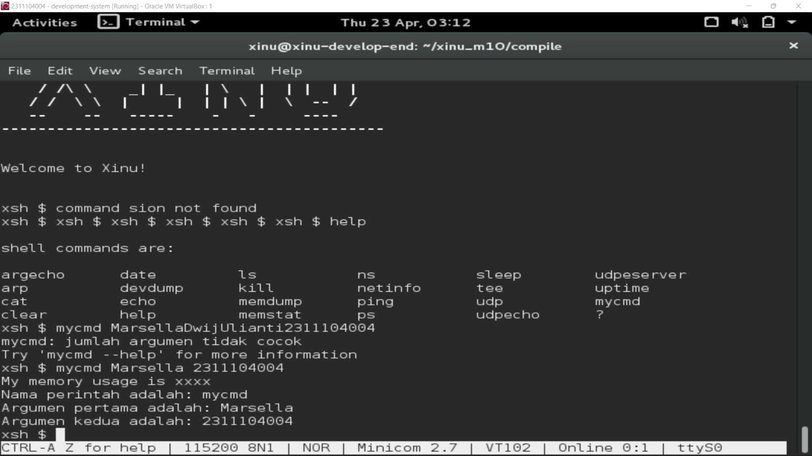
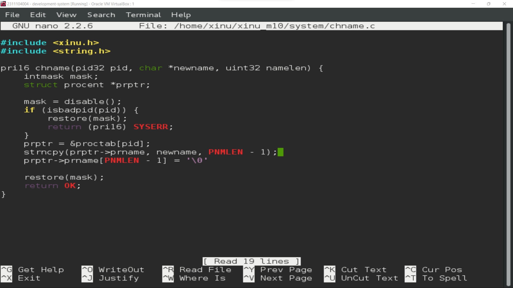
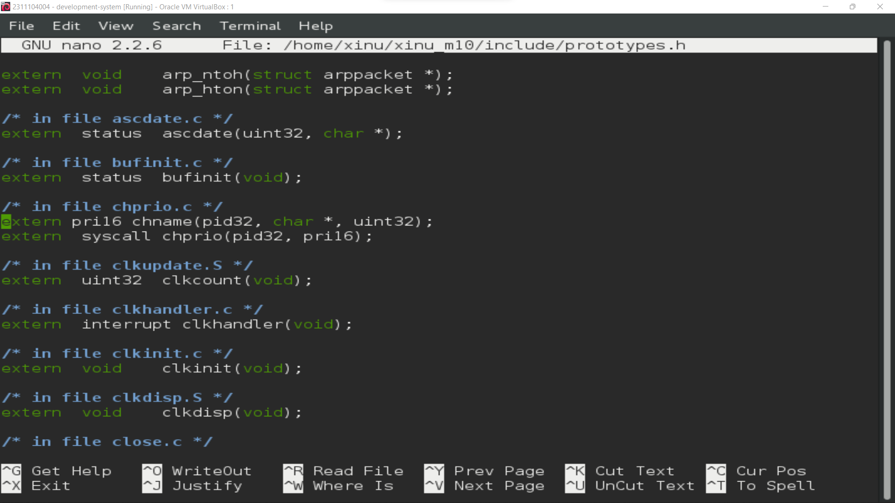
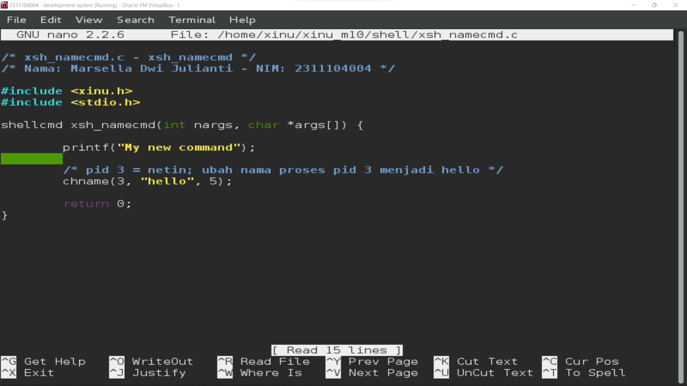
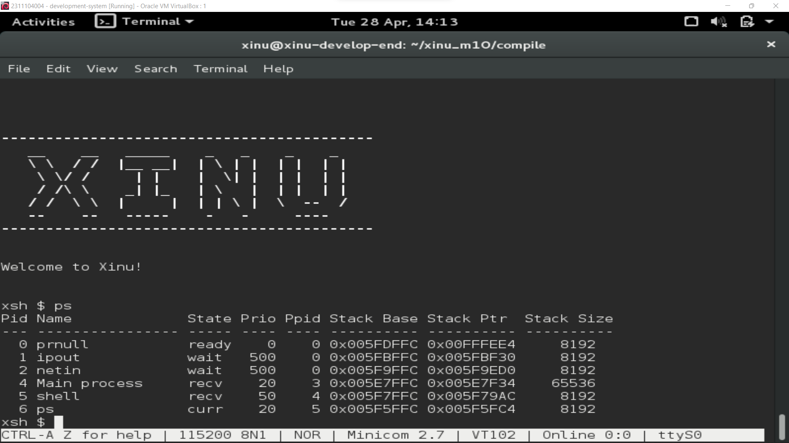
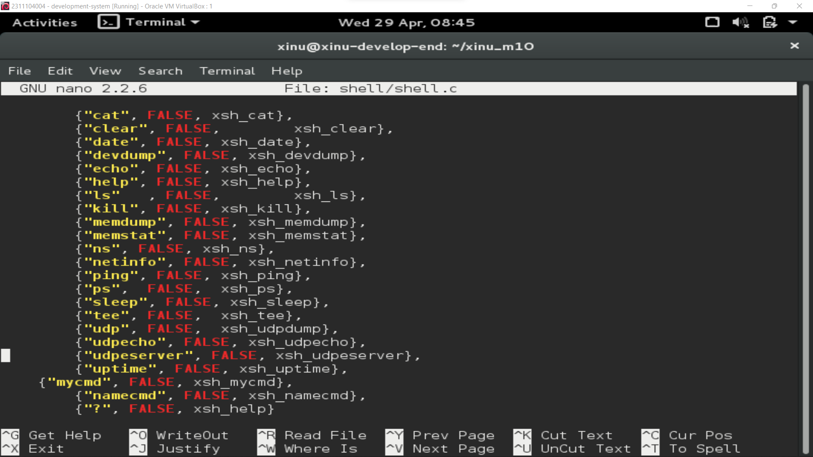
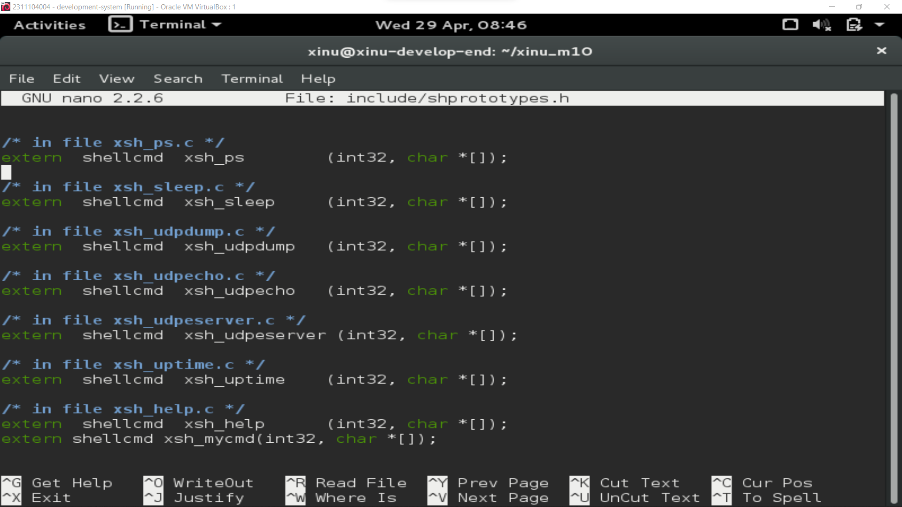
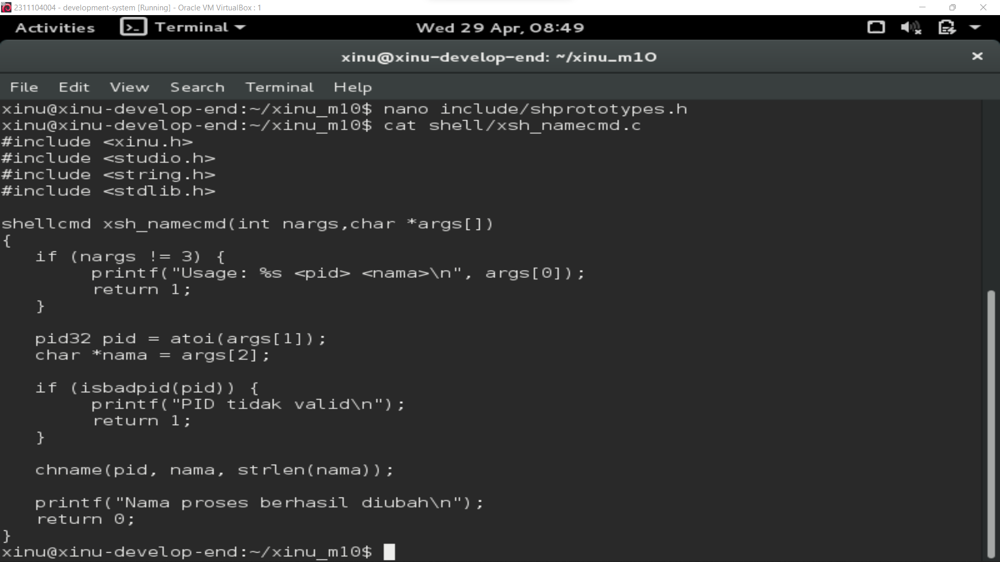
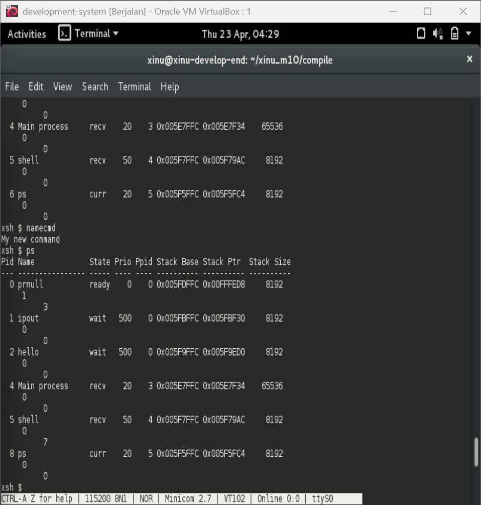

# <h1 align="center">Laporan Praktikum Modul 10 <br> Shell</h1>
<p align="center">Salman Alfarisi - 2311104036</p>

---

## Dasar Teori

Shell adalah program yang memproses perintah yang diberikan oleh user pada terminal. Shell akan melakukan looping secara terus menerus membaca baris input yang diberikan. Setelah sebuah baris input dibaca dan ditandai dengan adanya ENTER, shell harus mengekstrak nama perintah, argumen, dan hal-hal lainnya. Jika proses ekstraksi berhasil maka perintah akan dieksekusi sesuai dengan argumen yang diberikan.

Contoh perintah pada shell:
```
ls -al
nama_perintah = "ls"
argument 1   = "-al"
```

Cara kerja shell dapat dipelajari pada source code `./shell/shell.c`. Shell melakukan hal-hal berikut:
- Menampilkan banner dan startup message
- Looping membaca input dari user melalui `while(TRUE)`
- Menampilkan prompt (`xsh $`)
- Membaca perintah dan memparse token
- Mengeksekusi perintah sesuai dengan yang ada pada tabel `cmdtab[]`

Pada Xinu, shell command berada di dalam image (bukan di file system seperti Linux). Artinya, untuk menambahkan atau mengurangi perintah shell, Xinu harus di-compile ulang seluruhnya.

---

## Guided

### 10.1 Menjalankan Xinu dan Menggunakan Shell

Berikut hasil tampilan saat Xinu berhasil dijalankan dan shell aktif:



Dari gambar di atas terlihat bahwa:
- Prompt berganti menjadi `xsh $` menandakan Xinu sudah aktif pada backend VM
- Perintah `help` berhasil dieksekusi, menampilkan seluruh perintah yang tersedia pada Xinu seperti `argecho`, `date`, `ls`, `ns`, `sleep`, `udpeserver`, `arp`, `devdump`, `kill`, `netinfo`, `tee`, `uptime`, `cat`, `echo`, `memdump`, `ping`, `udp`, `mycmd`, dan lain-lain
- Perintah `mycmd` sudah berhasil ditambahkan dan muncul dalam daftar perintah
- Pengujian `mycmd MarsellaDwijUlianti2311104004` menampilkan pesan error karena jumlah argumen tidak cocok
- Pengujian `mycmd Marsella 2311104004` berhasil menampilkan output:
  - `My memory usage is xxxx`
  - `Nama perintah adalah: mycmd`
  - `Argumen pertama adalah: Marsella`
  - `Argumen kedua adalah: 2311104004`

---

### 10.2 Langkah Menambahkan Perintah Baru `mycmd`

#### a. Edit `shell.c`

Tambahkan entri `{"mycmd", FALSE, xsh_mycmd}` pada struct `cmdent cmdtab[]`:

```c
const struct cmdent cmdtab[] = {
    {"argecho",    TRUE,  xsh_argecho},
    {"arp",        FALSE, xsh_arp},
    ...
    {"uptime",     FALSE, xsh_uptime},
    {"mycmd",      FALSE, xsh_mycmd},   // <-- tambahkan ini
    {"?",          FALSE, xsh_help}
};
```

#### b. Edit `shprototype.h`

Tambahkan deklarasi ekstern berikut pada file `xinu/include/shprototype.h`:

```c
extern shellcmd xsh_mycmd (int32, char *[]);
```

#### c. Buat file `xsh_mycmd.c`

Buat file baru bernama `xsh_mycmd.c` pada folder `xinu/shell/` dengan isi sebagai berikut:

```c
/* xsh_mycmd.c - xsh_mycmd */

#include <xinu.h>
#include <stdio.h>
#include <string.h>

// deklarasi nama fungsi
static void printMemUse(void);

shellcmd xsh_mycmd(int nargs, char *args[]) {

    /* For argument '--help', emit help about the 'mycmd' command */
    // mycmd --help
    // jika perintah adalah "mycmd --help" tampilkan help
    if (nargs == 2 && strncmp(args[1], "--help", 7) == 0) {
        printf("Use: %s  argumentdd1 argumen2\n\n", args[0]);
        printf("Description:\n");
        printf("\tMy own command with 2 argument\n");
        printf("Options:\n");
        printf("\t--help\t display this help and exit\n");
        return 0;
    }

    /* Check for valid number of arguments */
    // banyaknya argument harus 2; args[0] = nama_perintah args[1] = argumen 1 args[2] = argumen 2
    if (nargs != 3) {
        fprintf(stderr, "%s: jumlah argumen tidak cocok\n", args[0]);
        fprintf(stderr, "Try '%s --help' for more information\n",
                        args[0]);
        return 1;
    }

    printMemUse();
    printf("Nama perintah adalah: %s \n", args[0]);
    printf("Argumen pertama adalah: %s \n", args[1]); // 123
    printf("Argumen kedua adalah: %s \n", args[2]);   // xxx
    return 0;
}

/*------------------------------------------------------------------------
 * printMemUse - Print statistics about memory use
 *------------------------------------------------------------------------
 */
void printMemUse(void){
    printf("My memory usage is xxxx\n");
}
```

#### d. Compile ulang Xinu

Pada development-system lakukan hal-hal berikut:

```bash
cd /home/xinu/xinu/compile
make clean
make
sudo minicom
```

#### e. Test hasil perintah baru pada shell

```bash
xsh $ mycmd
xsh $ mycmd MarsellaDwijUlianti2311104004
xsh $ mycmd Marsella 2311104004
```

---

## Unguided

### Soal 1 — [40 Poin] Modifikasi Syscall `chname` untuk Mengubah Nama Proses

Syscall `chname` dimodifikasi sehingga parameternya berubah dari `(pid32, pri16)` menjadi `(pid32, char*, uint32)`, agar dapat menerima nama baru dan panjang nama untuk kemudian mengubah nama suatu proses.

#### a. Modifikasi `include/prototypes.h`

Ubah deklarasi `chname` menjadi:

```c
/* in file chname.c */

extern  pri16   chname(pid32, char *, uint32);
```


#### b. Modifikasi `system/chname.c`

Ubah signature fungsi dari:

```c
pri16   chname(
        pid32   pid,        /* ID of process to change */
        pri16   newprio     /* New priority            */
        )
```

menjadi:

```c
pri16   chname(
        pid32   pid,        /* ID of process to change */
        char    *newname,
        uint32  namelen
        )
```

Berikut kode lengkap `chname.c` setelah dimodifikasi:

```c
/* chname.c - chname */
/* Nama: Marsella Dwi Julianti - NIM: 2311104004 */

#include <xinu.h>
#include <string.h>

/*------------------------------------------------------------------------
 * chname - Mengubah nama proses berdasarkan PID
 *------------------------------------------------------------------------
 */
pri16   chname(
        pid32   pid,        /* ID of process to change */
        char    *newname,   /* Nama baru untuk proses  */
        uint32  namelen     /* Panjang nama baru       */
        )
{
    intmask         mask;           /* Saved interrupt mask    */
    struct procent  *prptr;         /* Ptr to process's table entry */

    mask = disable();

    if (isbadpid(pid)) {
        restore(mask);
        return (pri16)SYSERR;
    }

    prptr = &proctab[pid];

    /* Salin nama baru ke prname, batasi sesuai PNMLEN */
    strncpy(prptr->prname, newname, PNMLEN - 1);
    prptr->prname[PNMLEN - 1] = '\0';

    restore(mask);
    return OK;
}
```


> **Penjelasan:** Fungsi `strncpy` digunakan untuk menyalin `newname` ke field `prname` pada struct `procent`. Panjang salinan dibatasi `PNMLEN - 1` agar tidak terjadi buffer overflow, dan karakter terakhir diisi `'\0'` untuk memastikan string selalu null-terminated.






#### Compile:

```bash
cd /home/xinu/xinu/compile
make clean
make
```

Outputnya:


---

### Soal 2 — [40 Poin] Membuat Perintah Baru `namecmd`

Buat perintah baru bernama `namecmd` pada shell Xinu yang memanggil syscall `chname()` untuk mengubah nama proses dengan PID tertentu.

#### a. Edit `shell/shell.c`

Tambahkan entri `namecmd` pada struct `cmdent cmdtab[]`:

```c
{"namecmd",    FALSE, xsh_namecmd},
```


#### b. Edit `include/shprototype.h`

Tambahkan deklarasi ekstern berikut:

```c
/* in file xsh_namecmd.c */
extern  shellcmd xsh_namecmd (int32, char *[]);
```


#### c. Buat file `shell/xsh_namecmd.c`

```c
/* xsh_namecmd.c - xsh_namecmd */
/* Nama: Marsella Dwi Julianti - NIM: 2311104004 */

#include <xinu.h>
#include <stdio.h>
#include <string.h>

shellcmd xsh_namecmd(int nargs, char *args[]) {

    printf("My new command");

    /* pid 3 = netin; mengubah nama proses pid 3 yaitu netin menjadi hello */
    chname(3, "hello", 5);

    return 0;
}
```


> **Penjelasan:** Perintah `namecmd` memanggil `chname(3, "hello", 5)` untuk mengubah nama proses dengan PID 3 (yaitu proses `netin`) menjadi `hello`. Parameter kedua adalah string nama baru, dan parameter ketiga adalah panjang string tersebut.

#### d. Compile ulang Xinu

```bash
cd /home/xinu/xinu/compile
make clean
make
sudo minicom
```


---

### Soal 3 — [20 Poin] Pengujian Perubahan Nama Proses

Langkah pengujian dilakukan di dalam terminal Xinu melalui minicom:

#### Langkah-langkah pengujian:

```bash
xsh $ ps
xsh $ namecmd
xsh $ ps
```

**Penjelasan alur pengujian:**

| Langkah | Perintah | Tujuan |
|---------|----------|--------|
| a | masuk terminal Xinu via minicom | Memastikan Xinu aktif |
| b | `xsh $ ps` | Melihat daftar proses sebelum perubahan, PID 3 masih bernama `netin` |
| c | `xsh $ namecmd` | Memanggil `chname(3, "hello", 5)` untuk mengubah nama PID 3 |
| d | `xsh $ ps` | Melihat daftar proses setelah perubahan |
| e | — | Verifikasi nama proses PID 3 telah berubah dari `netin` menjadi `hello` |

**Output yang diharapkan:**

Sebelum `namecmd`:
```
Pid  Name        ...
  3  netin       ...
```

Setelah `namecmd`:
```
Pid  Name        ...
  3  hello       ...
```


---

## Referensi

1. Modul Praktikum Sistem Operasi – Modul 10: Shell
2. Jurnal Praktikum Sistem Operasi – Modul 10: Shell
3. D. Comer, *"Operating System Design - The Xinu Approach"*, Second Edition, CRC Press, 2015.
4. Operating System Concepts – Silberschatz, Galvin, Gagne