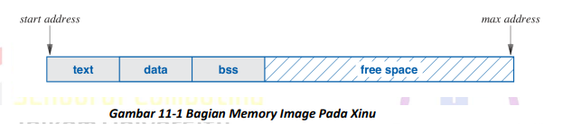
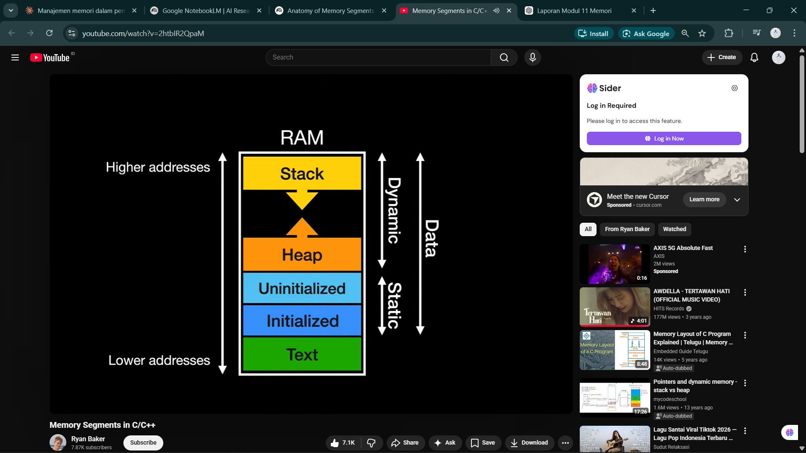
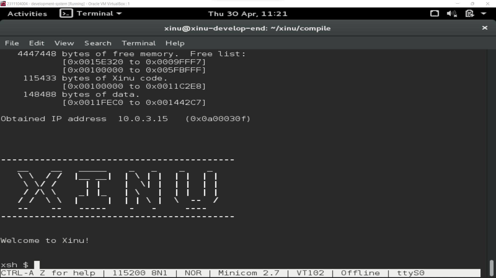
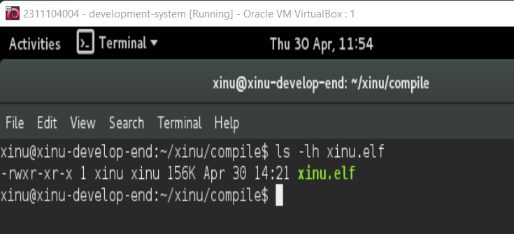
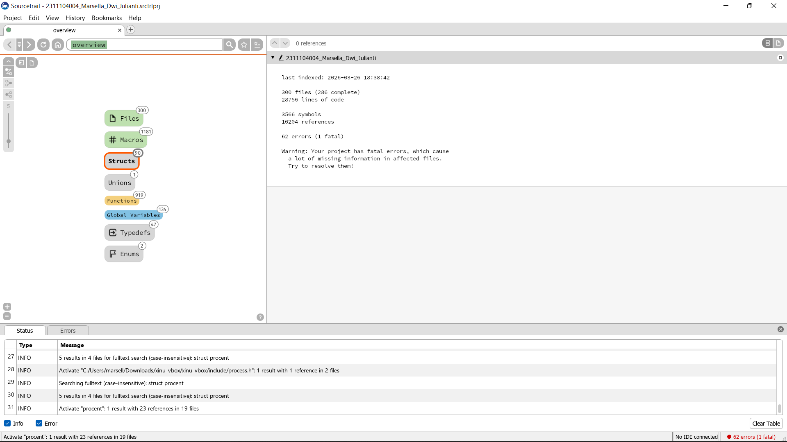
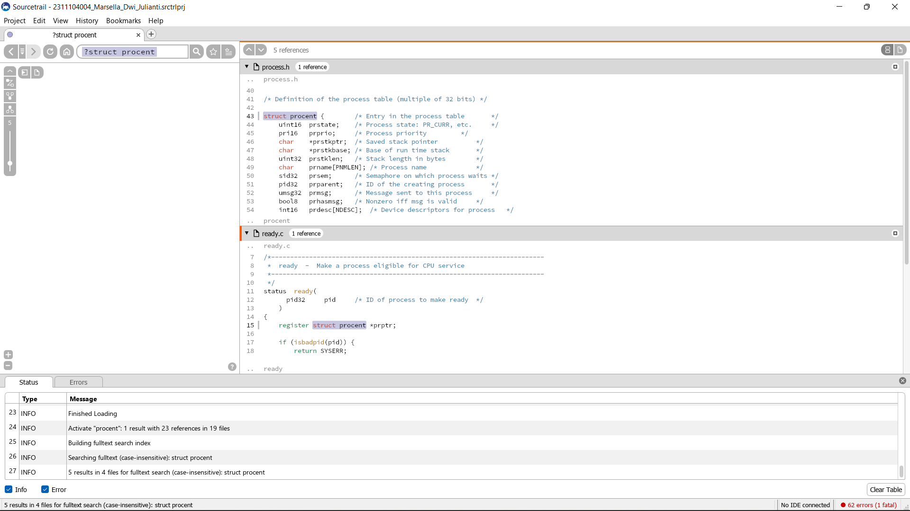
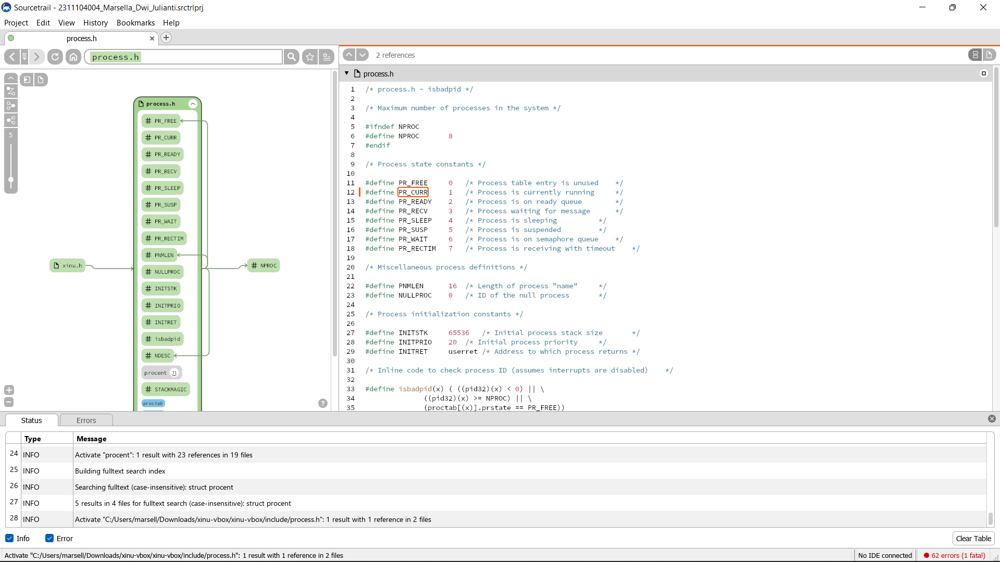
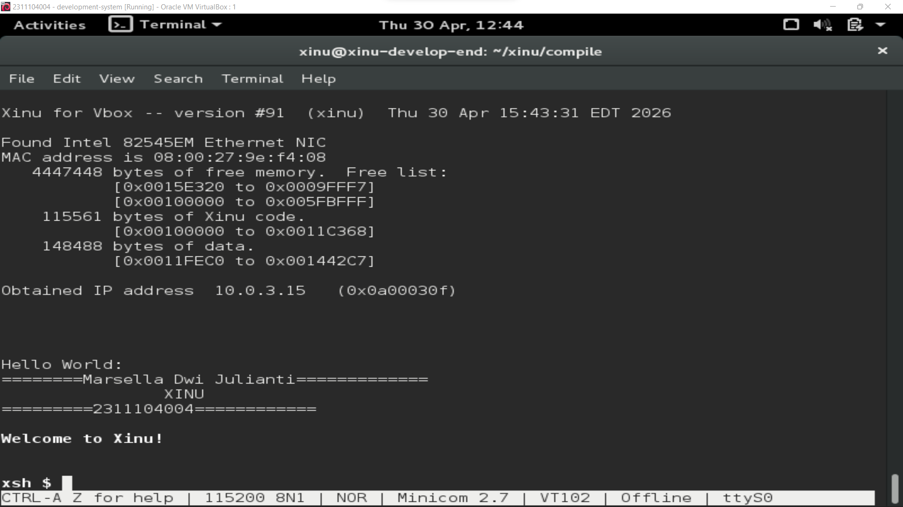

# <h1 align="center">Laporan Praktikum Modul 11   Memori Xinu </h1>

Salman Alfarisi - 2311104036

## Dasar Teori

Manajemen memori merupakan salah satu fungsi penting dalam sistem operasi yang bertugas mengatur penggunaan memori agar program dapat berjalan secara efisien dan terorganisir. Memori yang digunakan oleh program pada sistem seperti Xinu dibagi ke dalam beberapa segmen berdasarkan jenis data yang disimpan.

Secara umum, memori terbagi menjadi dua bagian besar yaitu teks (code) dan data, yang kemudian dirinci menjadi beberapa segmen utama. Segmen teks (text segment) berisi instruksi program yang telah dikompilasi ke dalam bahasa mesin. Segmen ini bersifat read-only sehingga tidak dapat diubah saat program berjalan.

Selanjutnya terdapat segmen data terinisialisasi (initialized data) yang menyimpan variabel global dan statis yang telah memiliki nilai awal. Berbeda dengan itu, segmen BSS (Block Started by Symbol) digunakan untuk menyimpan variabel global dan statis yang belum diinisialisasi, yang secara otomatis akan bernilai nol.

Selain segmen statis tersebut, terdapat dua segmen dinamis yaitu heap dan stack. Heap digunakan untuk alokasi memori secara dinamis yang dikontrol langsung oleh programmer, misalnya menggunakan fungsi malloc dan free. Heap bersifat fleksibel namun berisiko menyebabkan memory leak jika tidak dikelola dengan baik.

Stack digunakan untuk menyimpan data sementara seperti variabel lokal, parameter fungsi, dan alamat pengembalian fungsi. Stack bekerja dengan prinsip LIFO (Last In First Out), di mana data terakhir yang masuk akan menjadi yang pertama keluar. Stack sangat penting dalam mekanisme pemanggilan fungsi dalam program.

Pada sistem operasi Xinu, struktur memori dibagi menjadi text segment, data segment, BSS segment, dan free space. Free space ini nantinya digunakan untuk alokasi dinamis seperti stack dan heap saat sistem berjalan. Pengelolaan memori yang baik sangat penting untuk menjaga performa sistem dan mencegah terjadinya kesalahan seperti memory leak atau stack overflow.

## Guided

Pada praktikum Modul 11, dilakukan pemahaman mengenai struktur dan manajemen memori pada sistem operasi, khususnya pada Xinu. Berdasarkan materi dan rangkuman video, memori program dibagi menjadi beberapa segmen utama yang memiliki fungsi berbeda.

Segmen pertama adalah text segment yang berisi instruksi program dalam bentuk kode mesin. Segmen ini bersifat read-only sehingga tidak dapat diubah selama program berjalan. Hal ini bertujuan untuk menjaga integritas instruksi program.

Segmen berikutnya adalah initialized data segment, yaitu tempat penyimpanan variabel global dan statis yang telah diinisialisasi. Segmen ini bersifat read-write sehingga nilainya dapat diubah saat runtime.

Kemudian terdapat BSS segment yang digunakan untuk variabel global dan statis yang belum diinisialisasi. Semua data dalam segmen ini otomatis bernilai nol. Pemisahan segmen ini membantu menghemat ukuran file executable.

Selain itu, terdapat heap yang digunakan untuk alokasi memori dinamis. Heap dapat bertambah dan berkurang ukurannya sesuai kebutuhan program. Programmer bertanggung jawab penuh dalam pengelolaan heap, sehingga harus berhati-hati agar tidak terjadi memory leak.

Terakhir adalah stack yang digunakan untuk menyimpan data saat pemanggilan fungsi seperti parameter, variabel lokal, dan return address. Stack bekerja dengan metode LIFO sehingga pengelolaannya lebih terstruktur dan cepat.

Dalam Xinu, ketika sistem dijalankan, proses-proses baru akan menggunakan free space untuk alokasi memori. Alokasi dan dealokasi memori ini bersifat dinamis tergantung kebutuhan proses yang berjalan.

Struktur Memori Xinu

Keterangan: Menunjukkan pembagian memori menjadi text, data, BSS, dan free space.

Ilustrasi Penggunaan Memori

Keterangan: Menjelaskan bagaimana memori digunakan saat program berjalan.

Terminal Xinu

Keterangan: Menunjukkan sistem sedang aktif dan siap menggunakan memori.

## Unguided

## Soal 1 

Image hasil kompilasi Xinu

Setelah melakukan proses kompilasi pada Xinu menggunakan perintah make, akan dihasilkan file image bernama xinu.elf. File ini merupakan hasil kompilasi source code Xinu yang siap dijalankan.

File image tersebut berada pada direktori xinu/compile/. Selain itu, file tersebut juga akan disalin ke direktori /srv/tftp/ dengan nama xinu.boot yang digunakan untuk proses booting pada backend virtual machine.

Ukuran file xinu.elf bersifat dinamis tergantung pada kode program yang dikompilasi, namun umumnya berada pada kisaran ratusan kilobyte.

Keterangan:

Screenshot hasil kompilasi Xinu yang menghasilkan file xinu.elf beserta ukuran file dan lokasi penyimpanannya.

## Soal 2

Membaca Source Code Xinu

Keterangan:

Tampilan hasil eksplorasi source code Xinu pada Sourcetrail.

## Soal 3

Struktur data proses pada Xinu

Struktur data proses pada sistem operasi Xinu terdapat pada file:

👉 process.h (di folder xinu/include/)

Di dalam file tersebut terdapat struktur utama bernama:

👉 struct procent

Struktur ini merupakan Process Control Block (PCB) pada Xinu, yaitu struktur yang digunakan untuk menyimpan seluruh informasi terkait suatu proses.

Informasi yang disimpan dalam struct procent

Beberapa informasi penting yang disimpan antara lain:

1. prstate → status proses (running, ready, waiting, dll)

2. prprio → prioritas proses

3. prstkptr → pointer ke stack proses

4. prstkbase → alamat awal stack

5. prstklen → ukuran stack

6. prname → nama proses

7. prsem → semaphore yang digunakan

8. prparent → ID proses parent

9. prmsg → pesan yang dikirim ke proses

10. prhasmsg → penanda apakah ada pesan

Penjelasan singkat

Struktur procent digunakan oleh Xinu untuk mengelola proses. Setiap proses direpresentasikan sebagai satu entri dalam array proctab[], di mana indeks array tersebut berfungsi sebagai Process ID (PID).

Dengan struktur ini, sistem operasi dapat:

Mengatur proses, menjadwalkan eksekusi, dan menyimpan status dan informasi penting proses

Keterangan:

Struktur data proses pada Xinu yang terdapat pada file process.h. Struktur ini menyimpan informasi lengkap mengenai proses (PCB).

## Soal 4

Mengubah welcome banner pada Xinu

a. File yang menyimpan banner Xinu

Pada sistem Xinu yang digunakan, banner tidak secara langsung disimpan dalam satu file header tertentu seperti version.h. Berdasarkan hasil eksplorasi source code, banner direferensikan melalui variabel seperti SHELL_BAN0 hingga SHELL_BAN9 pada file shell.c.

Namun, pada implementasi praktikum ini, banner tidak ditemukan dalam bentuk definisi yang jelas pada file header, sehingga dilakukan modifikasi langsung pada file sumber.

b. File yang menampilkan banner Xinu

File yang bertanggung jawab untuk menampilkan banner adalah:

👉 shell.c (folder xinu/shell/)

Pada file ini terdapat fungsi fprintf() yang digunakan untuk mencetak banner ke layar saat shell dijalankan.

c. Perubahan banner

Perubahan dilakukan dengan mengganti bagian kode fprintf() pada file shell.c yang sebelumnya menggunakan variabel SHELL_BAN, menjadi teks langsung yang berisi identitas praktikan.

d. Langkah menjalankan hasil perubahan

Setelah melakukan perubahan, dilakukan kompilasi ulang dan menjalankan Xinu dengan langkah berikut:

cd xinu/compile
make clean
make
sudo minicom

Kemudian backend VM dijalankan hingga muncul tampilan Xinu dengan banner yang telah dimodifikasi.

## Referensi

1. https://en.wikipedia.org/wiki/Operating_system (diakses 2 Maret 2026)  
2. Modul Praktikum Sistem Operasi