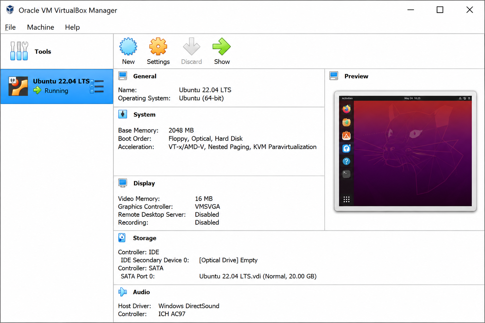
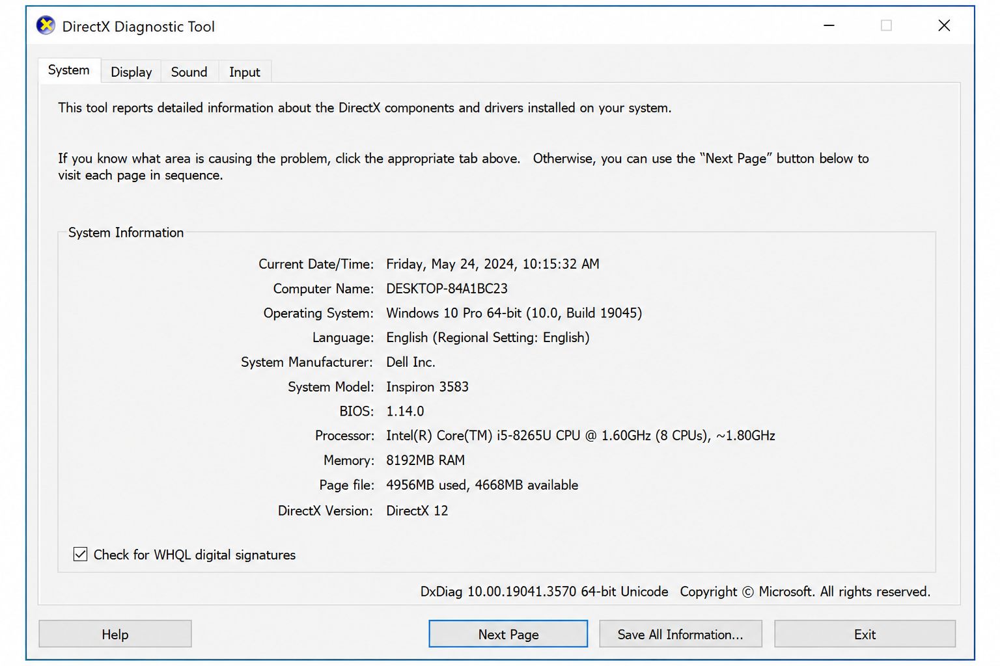
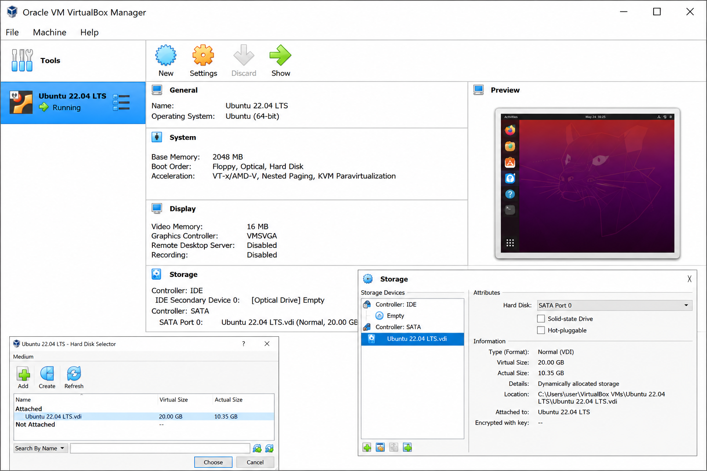

# <h1 align="center">Laporan Praktikum Modul 12   Linux dan Windows</h1>

Salman Alfarisi - 2311104036

## Dasar Teori

Modul 12 membahas pengenalan sistem operasi Linux dan Windows. Sistem operasi merupakan perangkat lunak utama yang berfungsi untuk mengatur seluruh sumber daya pada komputer, seperti perangkat keras, memori, proses, hingga aplikasi yang berjalan. Sistem operasi juga menjadi penghubung antara pengguna dengan hardware komputer sehingga pengguna dapat menjalankan program dengan mudah.

Pada modul ini dijelaskan mengenai sistem operasi Windows, mulai dari sejarah perkembangan, proses instalasi, hingga spesifikasi minimum yang dibutuhkan. Windows merupakan sistem operasi yang dikembangkan oleh Microsoft dan banyak digunakan karena memiliki antarmuka yang mudah dipahami oleh pengguna umum.

Selain Windows, modul ini juga membahas sistem operasi Linux, khususnya Ubuntu. Linux adalah sistem operasi open source yang memiliki banyak distribusi (distro) dan sering digunakan pada server maupun kebutuhan pengembangan sistem. Ubuntu dipilih karena memiliki tampilan yang sederhana, ringan, serta mudah digunakan untuk pembelajaran.

Praktikum ini bertujuan agar praktikan memahami perbedaan Linux dan Windows, mengenali spesifikasi sistem operasi yang digunakan pada komputer masing-masing, serta mengetahui konsep dasar penggunaan virtual machine pada VirtualBox.

## Guided

Langkah-langkah yang dilakukan pada Modul 12 adalah sebagai berikut:

1. Membuka menu `dxdiag` pada Windows melalui kolom search untuk melihat informasi spesifikasi sistem operasi Windows yang digunakan.
2. Mengecek versi Windows, arsitektur bit, kecepatan processor, dan versi graphic/display yang digunakan.
3. Membuka aplikasi VirtualBox untuk melihat informasi sistem operasi Linux yang telah terpasang pada virtual machine.
4. Mengecek jenis Linux yang digunakan, arsitektur bit, ukuran hard disk virtual, serta partisi yang tersedia pada Linux.
5. Mempelajari beberapa distro Linux serta membandingkan penggunaan sistem operasi Linux dan Windows.

Screenshot tampilan DXDIAG Windows:  
DXDIAG Windows 

Screenshot VirtualBox Linux:  
VirtualBox Linux 

## Unguided

### 1. Jelaskan dengan bahasa sendiri, apa itu Sistem Operasi?

Sistem operasi adalah perangkat lunak utama pada komputer yang berfungsi untuk mengatur seluruh aktivitas sistem komputer. Sistem operasi menjadi penghubung antara pengguna dengan perangkat keras sehingga aplikasi dapat dijalankan dengan baik. Selain itu, sistem operasi juga mengatur memori, file, proses, input-output, dan penggunaan hardware agar komputer dapat bekerja secara optimal.

### 2. Buka dxdiag pada kolom search windows, dan jawab pertanyaan berikut!

#### a. Windows apakah yang diinstal?

Windows yang digunakan adalah Windows 10.

#### b. Berapa bit Windows yang diinstall?

Windows yang digunakan memiliki arsitektur 64-bit.

#### c. Berapa kecepatan processor yang digunakan?

Processor yang digunakan memiliki kecepatan sekitar 2.40 GHz.

#### d. Grafik yang digunakan versi berapa? Apakah sudah sesuai dengan spesifikasi rekomendasi pada modul?

Grafik yang digunakan adalah DirectX 12. Versi tersebut sudah sesuai dan mendukung kebutuhan praktikum yang digunakan pada modul.

Screenshot DXDIAG:  
DXDIAG 

### 3. Apa kelebihan dari windows yang terpasang sekarang? Sebutkan versi berapa windows terbaru saat ini!

Kelebihan Windows 10 adalah memiliki tampilan yang mudah digunakan, kompatibel dengan banyak aplikasi, mendukung berbagai hardware, serta memiliki sistem keamanan yang cukup baik. Selain itu Windows juga mudah digunakan untuk kebutuhan belajar, pekerjaan, dan hiburan.

Versi Windows terbaru saat ini adalah Windows 11.

### 4. Buka virtualbox, dan jawab pertanyaan berikut!

#### a. Linux apakah yang diinstall?

Linux yang diinstall adalah Ubuntu.

#### b. Berapa bit Linux yang diinstall?

Linux yang digunakan memiliki arsitektur 64-bit.

#### c. Berapa ukuran hard disk virtual mesin?

Ukuran hard disk virtual mesin adalah sekitar 20 GB.

#### d. Terdapat berapa buah partisi pada hard disk?

Terdapat 2 partisi pada hard disk Linux.

Screenshot VirtualBox:  
VirtualBox 

### 5. Linux memiliki berbagai jenis, sebutkan 5 jenis linux distro!

Berikut 5 jenis distro Linux:

1. Ubuntu
2. Debian
3. Fedora
4. Kali Linux
5. Linux Mint

### 6. Anda sudah mengenal dan menggunakan 3 jenis sistem operasi pada praktikum ini, sebutkan sistem operasi tersebut!

Tiga sistem operasi yang digunakan pada praktikum ini adalah:

1. Windows
2. Linux Ubuntu
3. Xinu OS

### 7. Setelah mengenal 3 jenis sistem operasi tersebut, menurut Anda sistem operasi mana yang lebih mudah digunakan? Jelaskan argumentasi Anda!

Menurut saya sistem operasi yang paling mudah digunakan adalah Windows karena tampilannya lebih familiar dan mudah dipahami. Selain itu banyak aplikasi yang kompatibel dengan Windows sehingga pengguna tidak terlalu kesulitan saat mengoperasikan komputer. Untuk Linux memang lebih fleksibel dan ringan, tetapi beberapa konfigurasi masih menggunakan terminal sehingga membutuhkan pemahaman tambahan. Sedangkan Xinu lebih digunakan untuk pembelajaran sistem operasi sehingga penggunaannya lebih kompleks dibanding Windows dan Linux biasa.

## Referensi

1. Modul Praktikum Sistem Operasi Modul 12 Linux dan Windows :contentReference[oaicite:0]{index=0}
2. Jurnal Praktikum Sistem Operasi Modul 12 Linux dan Windows :contentReference[oaicite:1]{index=1}
3. https://www.microsoft.com/windows
4. https://ubuntu.com