# <h1 align="center">Laporan Praktikum Modul 13 <br> Perintah Dasar Linux</h1>
<p align="center">Salman Alfarisi - 2311104036</p>

---

## Dasar Teori

Linux adalah sistem operasi berbasis Unix yang menggunakan antarmuka berbasis teks (terminal/command line) sebagai salah satu cara utama berinteraksi dengan sistem. Perintah-perintah dasar Linux dieksekusi pada Bash (/bin/bash), yaitu sebuah shell yang menginterpretasikan perintah yang dimasukkan pengguna ke dalam konsol.

Struktur penulisan perintah Linux mengikuti format umum berikut:

```
$ Perintah [-opsi] [argument_1] [argument_2]
```

Penulisan perintah Linux bersifat **case sensitive**, artinya huruf besar dan huruf kecil dibedakan. Tanda `$` menunjukkan user biasa, sedangkan `#` menunjukkan user root yang memiliki hak akses penuh.

Beberapa perintah dasar yang dipelajari pada modul ini antara lain:

- **ls** – menampilkan isi direktori
- **cd** – berpindah direktori
- **cp** – menyalin file atau direktori
- **rm** – menghapus file atau direktori
- **mv** – memindahkan atau mengganti nama file
- **mkdir** – membuat direktori baru
- **pwd** – menampilkan direktori kerja saat ini
- **man** – menampilkan manual dari suatu perintah
- **| (pipe)** – menggabungkan output suatu perintah sebagai input perintah berikutnya
- **Redirection (>, >>)** – menyimpan output ke dalam file

Selain itu, pada modul ini juga dipelajari cara mengkompilasi program menggunakan **GCC (GNU Compiler Collection)**, yaitu compiler untuk bahasa C yang merupakan komponen kunci dari GNU Toolchain. Cara mengkompilasi source code menggunakan GCC adalah:

```
$ gcc source_code.c -o program_hasil
$ ./program_hasil
```

---

## Guided

Pada sesi guided Modul 13, praktikan mempelajari dan mempraktikkan perintah-perintah dasar Linux secara langsung di terminal Ubuntu.

### 1. Terminal

Terminal Linux menampilkan command prompt dengan format:

```
username@hostname:working_directory$
```

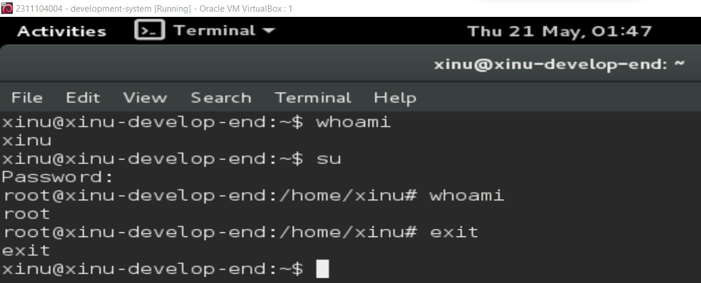

**Penjelasan command prompt:**
- `username` – nama user yang sedang login
- `hostname` – nama komputer
- `working_directory` – direktori yang sedang aktif (tilde `~` berarti home directory)
- `$` – menandakan user biasa (bukan root)

---

### 2. Perintah Pertama

#### a. Perintah `ls`

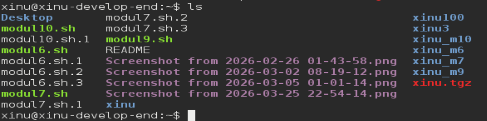

```bash
$ ls
```

- **Option:** tidak ada
- **Parameter:** tidak ada
- **Fungsi:** menampilkan daftar file dan direktori di direktori aktif saat ini

#### d. Perintah `ls -al /`

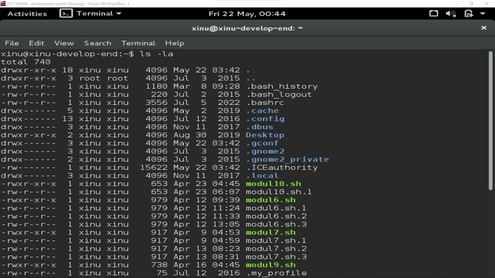

```bash
$ ls -al /
```

- **Option:** `-al` (`-a` = tampilkan semua file termasuk hidden, `-l` = tampilkan detail)
- **Parameter:** `/` (direktori root)
- **Fungsi:** menampilkan seluruh isi direktori root secara detail termasuk file tersembunyi

**Perbedaan hasil:**
Perintah `ls` tanpa option hanya menampilkan file dan folder di direktori aktif tanpa detail. Sedangkan `ls -al /` menampilkan semua isi direktori root secara lengkap beserta informasi permission, owner, ukuran, dan tanggal modifikasi, termasuk file tersembunyi (yang diawali titik).

---

### 3. Pohon File

#### a. Perintah `pwd`

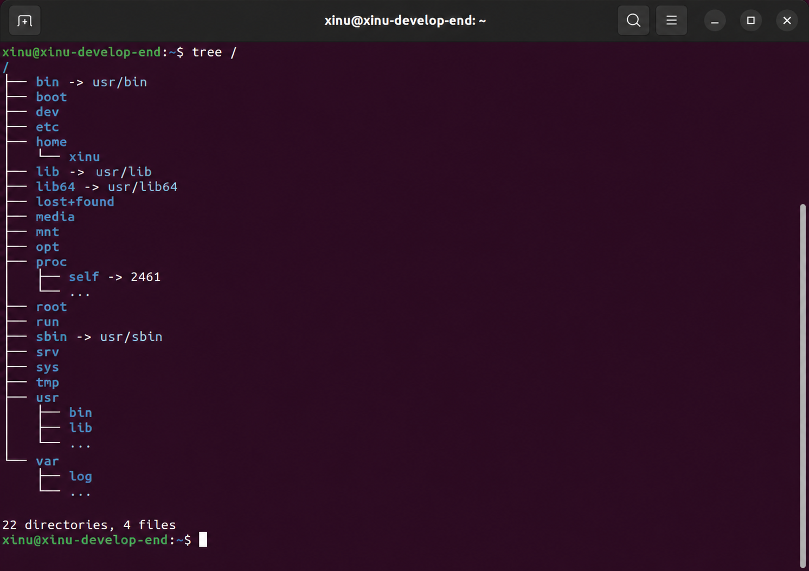

```bash
$ pwd
```

- **Option:** tidak ada
- **Parameter:** tidak ada
- **Fungsi:** menampilkan path lengkap dari direktori kerja (working directory) yang sedang aktif saat ini

---

### 4. Perpindahan

#### a. Perintah `cd /`

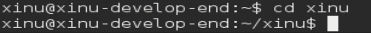

```bash
$ cd /
```

- **Option:** tidak ada
- **Parameter:** `/` (direktori root)
- **Fungsi:** berpindah ke direktori root (`/`) dari direktori mana pun

---

### 5. Direktori Khusus

#### a. Perintah `cd /` kemudian `cd ~`

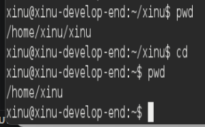

```bash
$ cd /
$ pwd
/
$ cd ~
$ pwd
/home/[username]
```

- `cd /` → berpindah ke direktori root, sehingga `pwd` menampilkan `/`
- `cd ~` → berpindah ke home directory user yang sedang login, sehingga `pwd` menampilkan `/home/[username]`

#### b. Perintah `cd /proc/self` lalu kembali ke root menggunakan `cd ..`

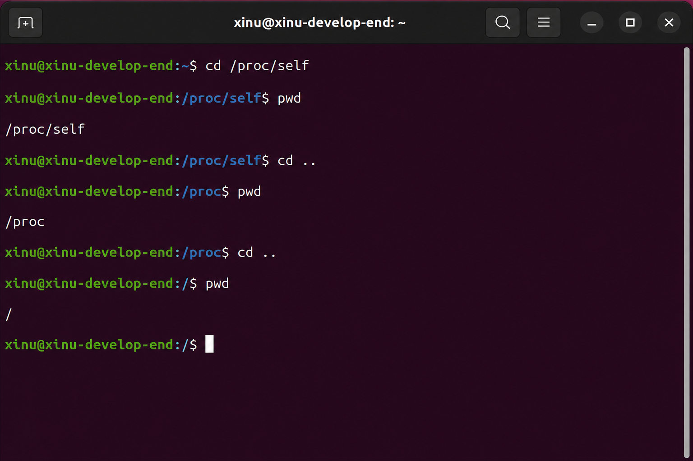

```bash
$ cd /proc/self
$ cd ..
$ cd ..
$ pwd
/
```

Perintah `cd ..` harus dieksekusi **2 kali** untuk berpindah dari `/proc/self` ke `/`:
- `cd ..` pertama → pindah dari `/proc/self` ke `/proc`
- `cd ..` kedua → pindah dari `/proc` ke `/` (root)

---

### 6. Copy, Rename, dan Delete File

#### a. Copy file `/proc/cpuinfo` ke folder home


```bash
$ cp /proc/cpuinfo /home/[username]/
```

#### b. Verifikasi file cpuinfo telah ter-copy

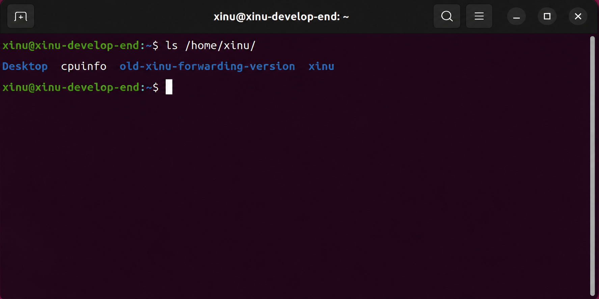

```bash
$ ls /home/[username]/
```

#### c. Copy file `/proc/uptime` ke folder home

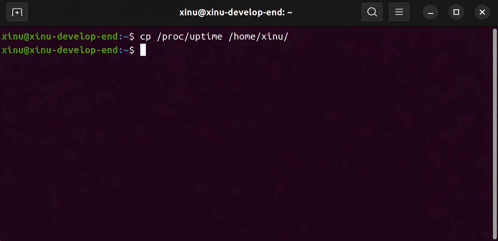

```bash
$ cp /proc/uptime /home/[username]/
```

#### d. Verifikasi file uptime telah ter-copy

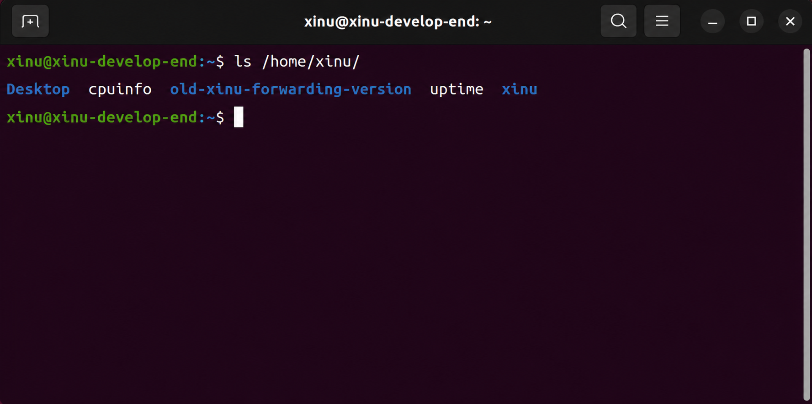

```bash
$ ls /home/[username]/
```

#### e. Hapus file uptime di folder home

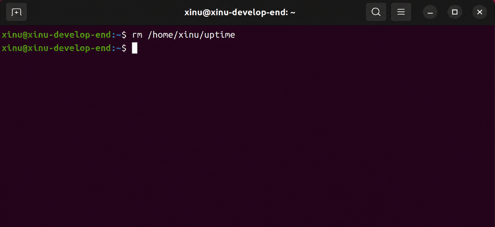

```bash
$ rm /home/[username]/uptime
```

#### f. Verifikasi file uptime telah terhapus

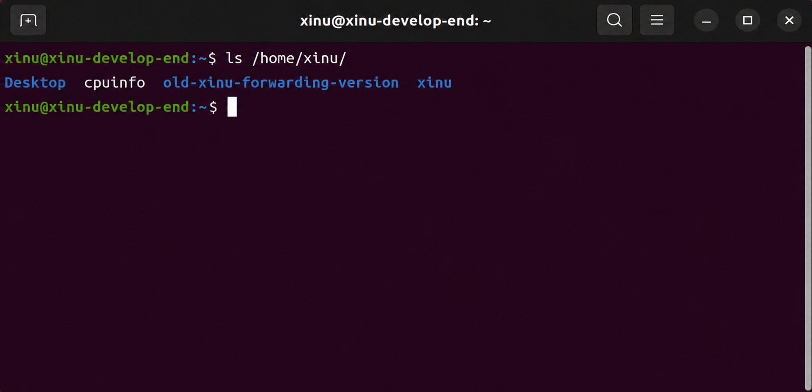

```bash
$ ls /home/[username]/
```

#### g. Rename file cpuinfo menjadi infocpu

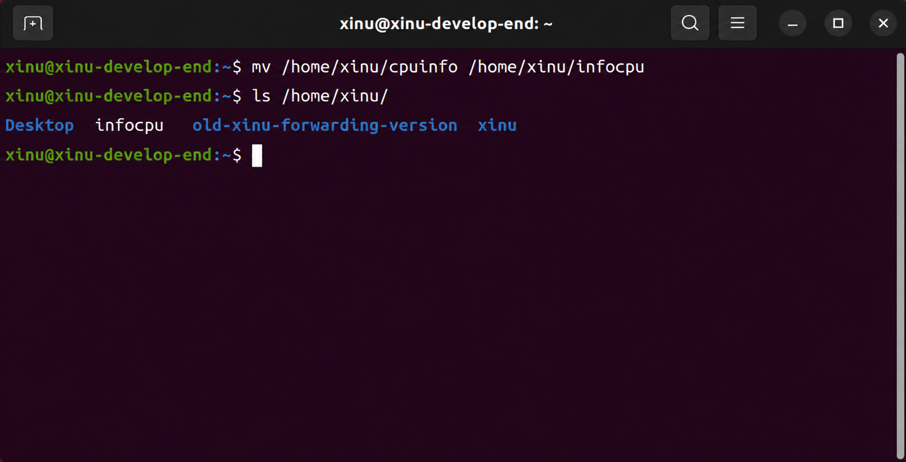

```bash
$ mv /home/[username]/cpuinfo /home/[username]/infocpu
$ ls /home/[username]/
```

---

### 7. Membuat Folder Baru

#### a & b. Membuat folder dengan nama NIM dan di dalamnya folder dengan nama

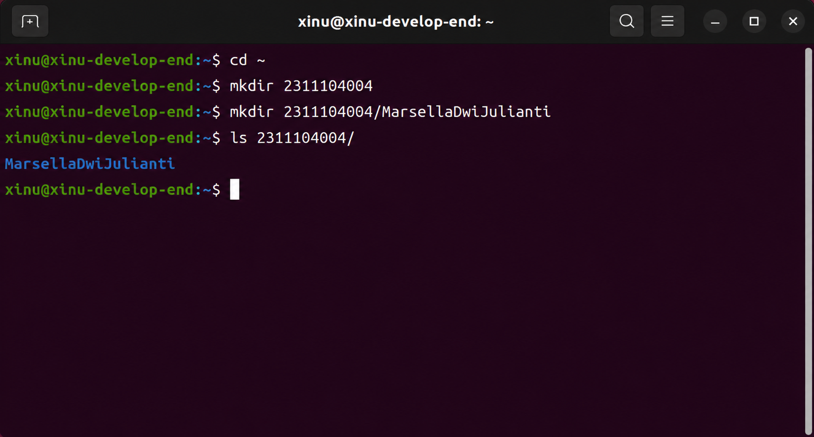

```bash
$ cd ~
$ mkdir 2311104004
$ mkdir 2311104004/MarsellaDwiJulianti
$ ls 2311104004/
```

---

### 8. Membaca Manual

#### a. Manual untuk perintah `ls`

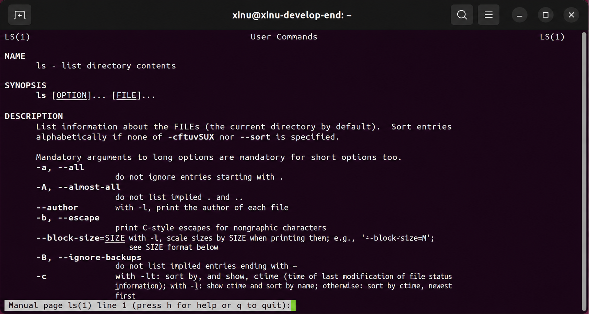

```bash
$ man ls
```

**b. Fungsi perintah `ls`:**
Perintah `ls` digunakan untuk menampilkan daftar isi dari sebuah direktori. Secara default, menampilkan nama file dan direktori yang ada di direktori aktif.

**c. Pencipta perintah `ls`:**
Berdasarkan manual, `ls` ditulis oleh Richard M. Stallman dan David MacKenzie.

**d. Arti `-h` dari manual ls:**
Option `-h` atau `--human-readable` berfungsi untuk menampilkan ukuran file dalam format yang mudah dibaca manusia, seperti KB (K), MB (M), atau GB (G), bukan dalam satuan bytes mentah. Harus digunakan bersama opsi `-l` atau `-s`.

**e. Option untuk melihat direktori secara rekursif:**
Option `-R` atau `--recursive` digunakan agar `ls` menampilkan isi direktori secara rekursif (termasuk subdirektori dan isinya).

#### f. Manual untuk perintah `cp`


```bash
$ man cp
```

**g. Fungsi perintah `cp`:**
Perintah `cp` digunakan untuk menyalin (copy) file atau direktori dari satu lokasi ke lokasi lain.

**h. Pencipta perintah `cp`:**
Berdasarkan manual, `cp` ditulis oleh Torbjorn Granlund, David MacKenzie, dan Jim Meyering.

**i. Arti `-v` dalam perintah `cp`:**
Option `-v` atau `--verbose` berfungsi untuk menampilkan nama file yang sedang disalin ke layar konsol, sehingga user dapat melihat proses penyalinan berlangsung.

**j. Option untuk mode interaktif:**
Option `-i` atau `--interactive` digunakan agar `cp` meminta konfirmasi (prompt) sebelum menimpa file yang sudah ada di lokasi tujuan.

---

### 9. Pipe

#### a. Perintah `cat /etc/passwd`

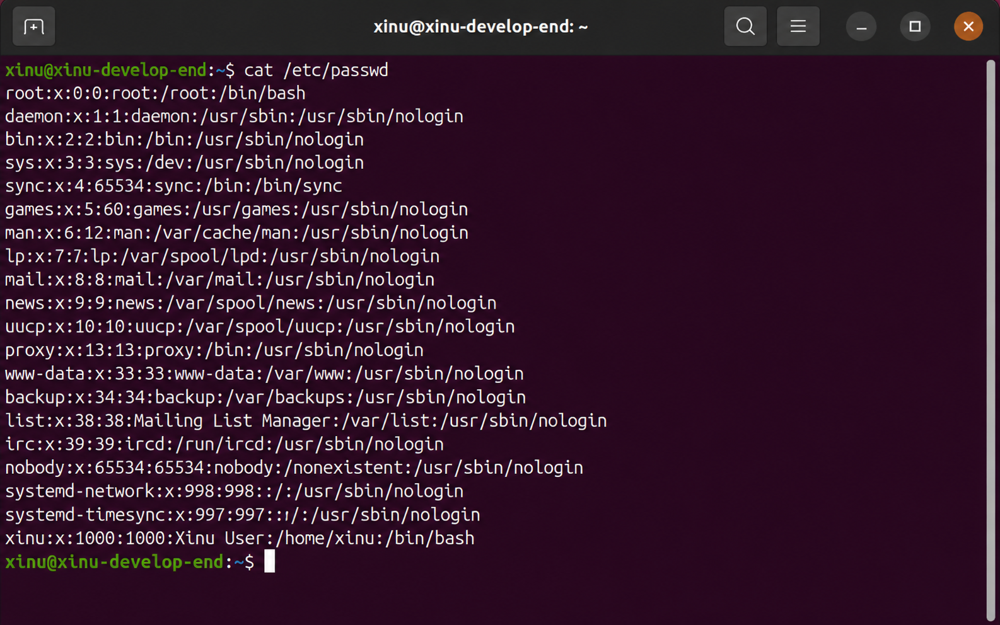

```bash
$ cat /etc/passwd
```

**b. Fungsi perintah `cat`:**
Perintah `cat` (concatenate) digunakan untuk menampilkan isi suatu file ke layar konsol/terminal.

#### c. Perintah dengan grep daemon

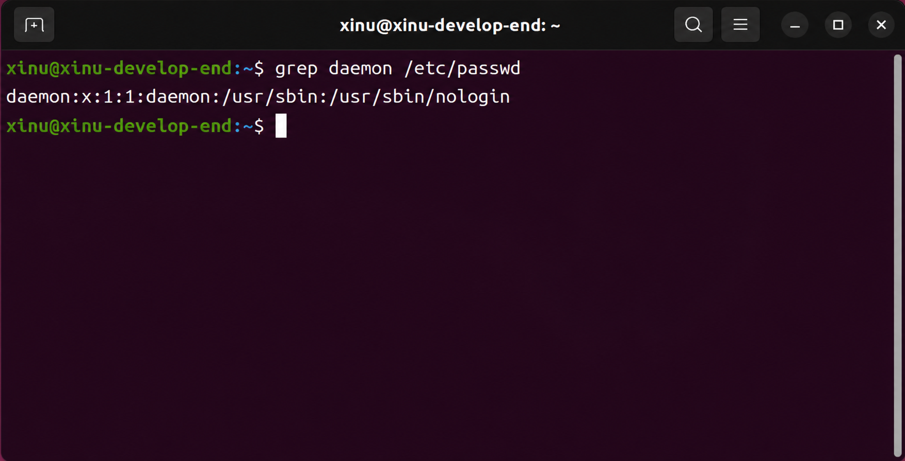

```bash
$ cat /etc/passwd | grep daemon
```

#### d. Perintah dengan grep root

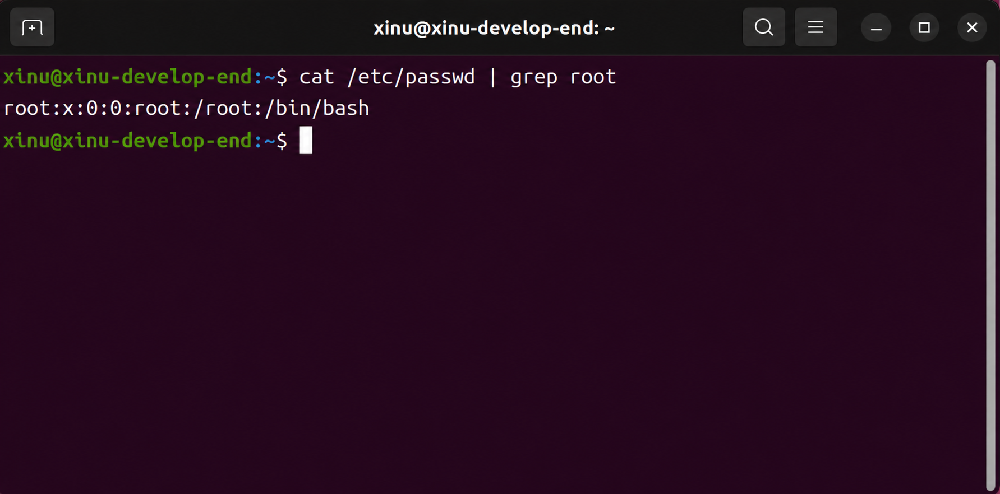

```bash
$ cat /etc/passwd | grep root
```

#### e. Perintah dengan grep nobody

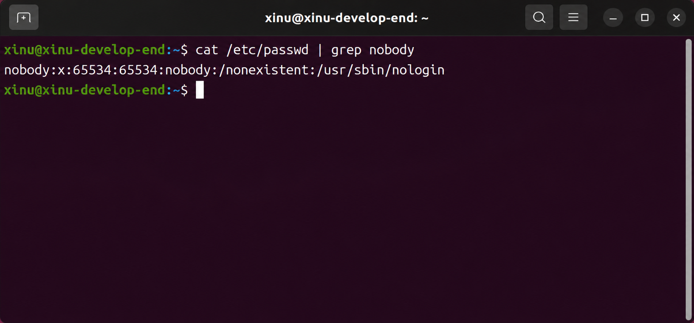

```bash
$ cat /etc/passwd | grep nobody
```

**f. Fungsi perintah `| grep daemon`:**
Simbol `|` (pipe) mengambil output dari perintah sebelumnya (`cat /etc/passwd`) dan menjadikannya sebagai input untuk perintah berikutnya (`grep daemon`). `grep daemon` berfungsi untuk memfilter dan hanya menampilkan baris-baris yang mengandung kata "daemon" dari output tersebut.

---

### 10. Redirection

#### a. Perintah `ls -al > /home/[username]/result.txt`

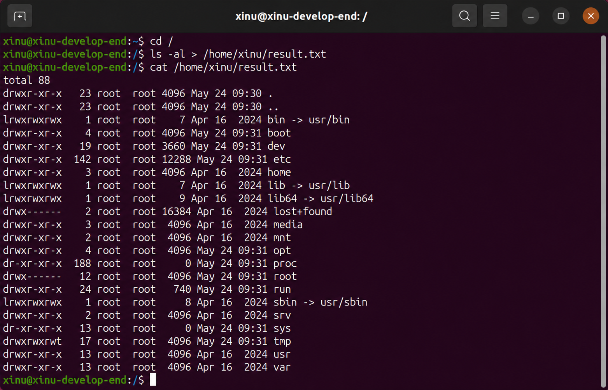

```bash
$ cd /
$ ls -al > /home/[username]/result.txt
```

**Penjelasan:** Perintah `ls -al` dijalankan dari direktori `/`, lalu seluruh outputnya tidak ditampilkan di terminal melainkan disimpan (ditulis) ke dalam file `result.txt` di folder home.

**b. Lokasi file result.txt:**
File `result.txt` berada di `/home/[username]/result.txt`

#### c. Perintah `ls -al > /home/[username]/result.txt` dari `/etc`

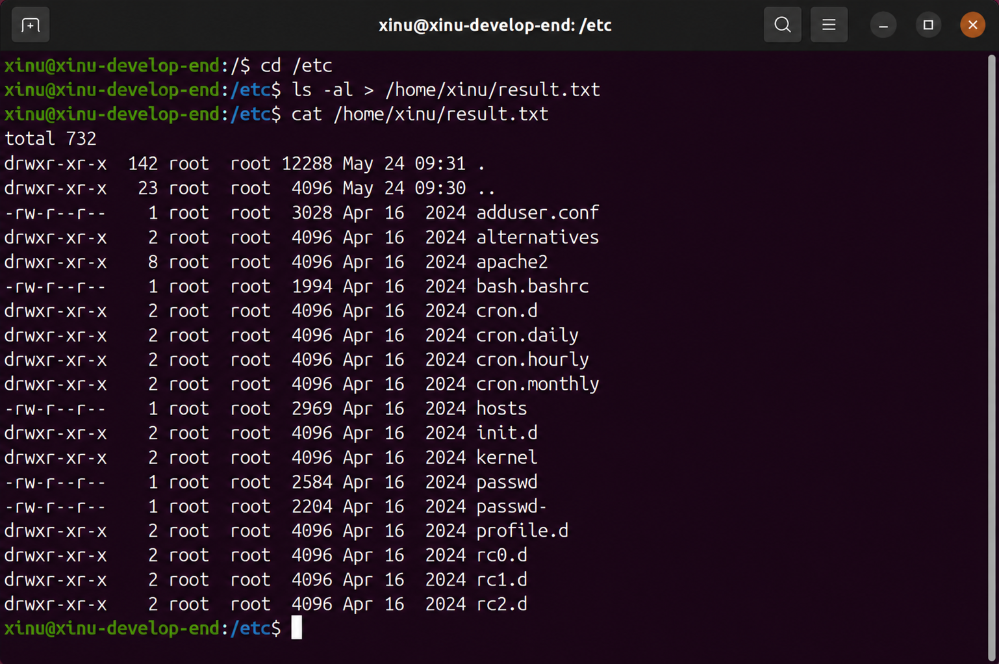

```bash
$ cd /etc
$ ls -al > /home/[username]/result.txt
```

**Penjelasan:** Perintah ini mengeksekusi `ls -al` dari direktori `/etc` dan menyimpan hasilnya ke `result.txt`. Karena menggunakan `>`, isi file `result.txt` sebelumnya (daftar direktori `/`) akan **ditimpa (overwrite)** dan digantikan dengan daftar isi direktori `/etc`.

**d. Fungsi perintah `>`:**
Perintah `>` adalah operator redirection yang menyimpan output dari suatu perintah ke dalam file. Jika file sudah ada, isinya akan **ditimpa (overwrite)**. Jika file belum ada, file baru akan dibuat.

#### e. Perintah `ls -al >> /home/[username]/result1.txt` dari `/`

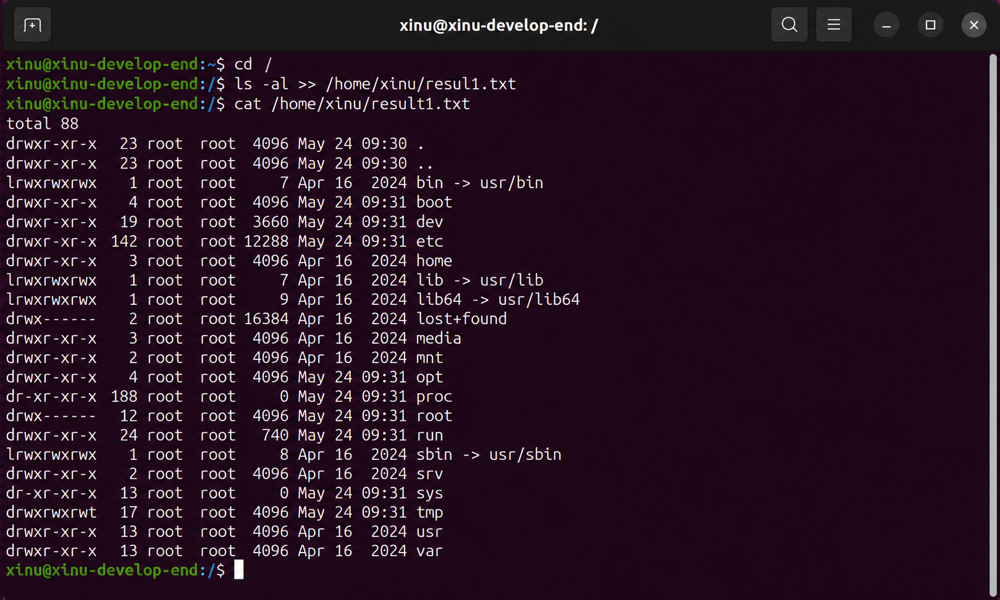

```bash
$ cd /
$ ls -al >> /home/[username]/result1.txt
```

**Penjelasan:** Perintah ini menyimpan output `ls -al` dari direktori `/` ke dalam `result1.txt`. Jika file belum ada, file baru dibuat. Jika sudah ada, output ditambahkan di akhir file (append).

#### f. Perintah `ls -al >> /home/[username]/result1.txt` dari `/etc`

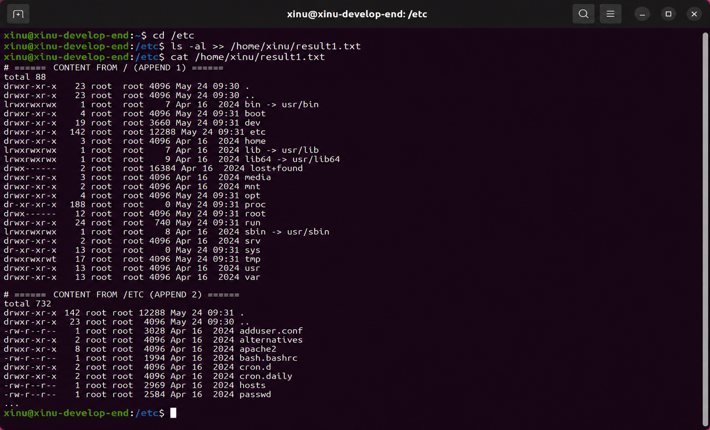

```bash
$ cd /etc
$ ls -al >> /home/[username]/result1.txt
```

**Penjelasan:** Perintah ini menambahkan (append) output `ls -al` dari direktori `/etc` ke akhir file `result1.txt`, sehingga file berisi dua bagian: daftar isi `/` diikuti daftar isi `/etc`.

**g. Perbedaan `>` dan `>>`:**
- `>` (overwrite): Menyimpan output ke file dan **menimpa** isi file jika sudah ada
- `>>` (append): Menyimpan output ke file dengan **menambahkan** di bagian akhir tanpa menghapus isi yang sudah ada

---

## Unguided

### I. Perintah-Perintah Dasar Linux (Total 83 poin)

> **Catatan:** Setiap soal di bawah ini memerlukan screenshot terminal yang menunjukkan perintah yang dijalankan beserta hasilnya.

---

#### 1. Terminal (4 poin)

**a. Jalankan dan screenshot terminal!**

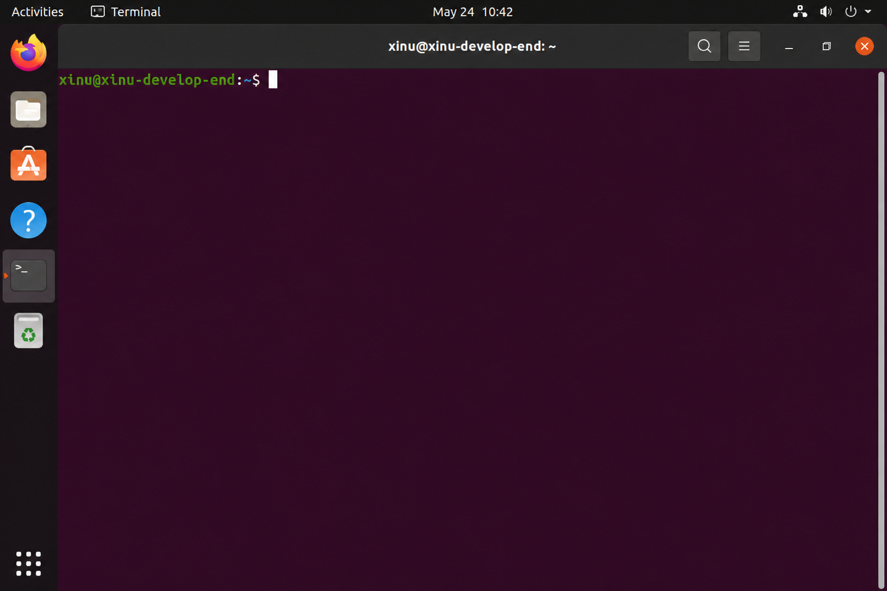

**b. Jelaskan arti dari command prompt milik Anda!**

Contoh: `marsella@ubuntu:~$`

| Bagian | Nilai | Keterangan |
|--------|--------|------------|
| `xinu` | username | Nama pengguna (user) yang sedang login pada sistem Linux |
| `xinu-develop-end` | hostname | Nama komputer atau mesin yang sedang digunakan |
| `~` | working directory | Menunjukkan direktori home dari user yang sedang aktif (`/home/xinu`) |
| `$` | user mode | Menandakan terminal dijalankan sebagai user biasa (bukan administrator/root) |

---

#### 2. Perintah Pertama (7 poin)

**a. Jalankan dan screenshot perintah: `ls`**

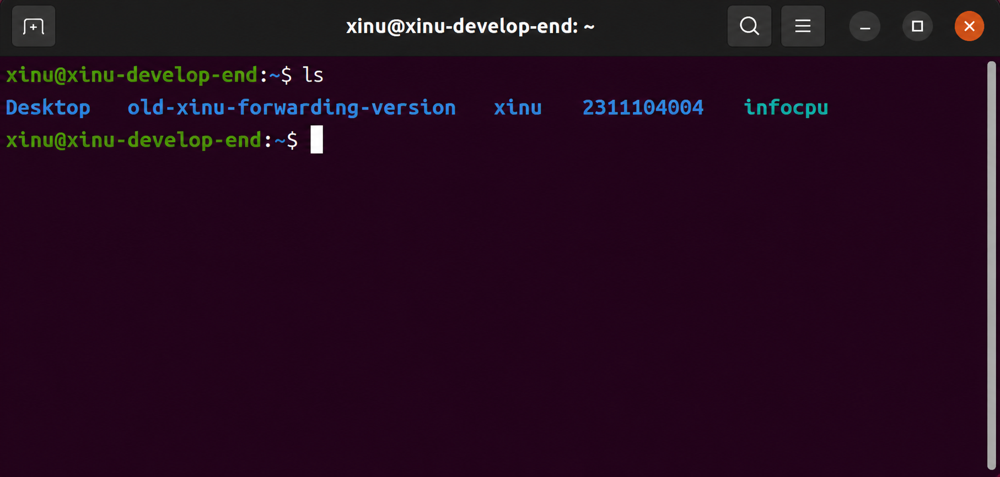

**b. Option dan parameter dari perintah `ls`:**
- Option: tidak ada
- Parameter: tidak ada

**c. Fungsi perintah `ls`:**
Menampilkan daftar nama file dan direktori yang berada di direktori aktif saat ini.

**d. Jalankan perintah: `ls -al /`**

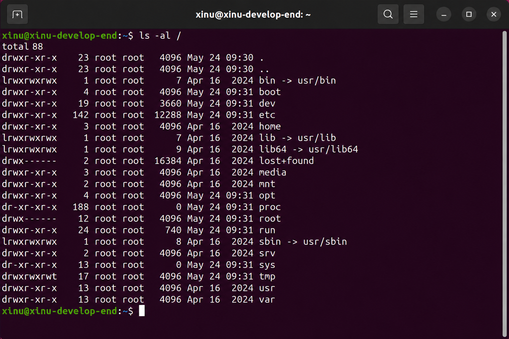

**e. Option dan parameter dari perintah `ls -al /`:**
- Option: `-al` (gabungan `-a` untuk all/semua file dan `-l` untuk long format/detail)
- Parameter: `/` (direktori root sebagai target)

**f. Fungsi perintah `ls -al /`:**
Menampilkan seluruh isi direktori root (`/`) secara detail, termasuk file tersembunyi, beserta informasi permission, jumlah link, owner, group, ukuran, tanggal, dan nama file.

**g. Mengapa hasilnya berbeda?**
`ls` hanya menampilkan nama file di direktori saat ini tanpa detail. `ls -al /` menampilkan isi direktori root secara lengkap termasuk file hidden (berawalan titik) dengan informasi lengkap setiap file karena menggunakan dua option berbeda sekaligus.

---

#### 3. Pohon File (6 poin)

**a. Jalankan dan screenshot perintah: `pwd`**

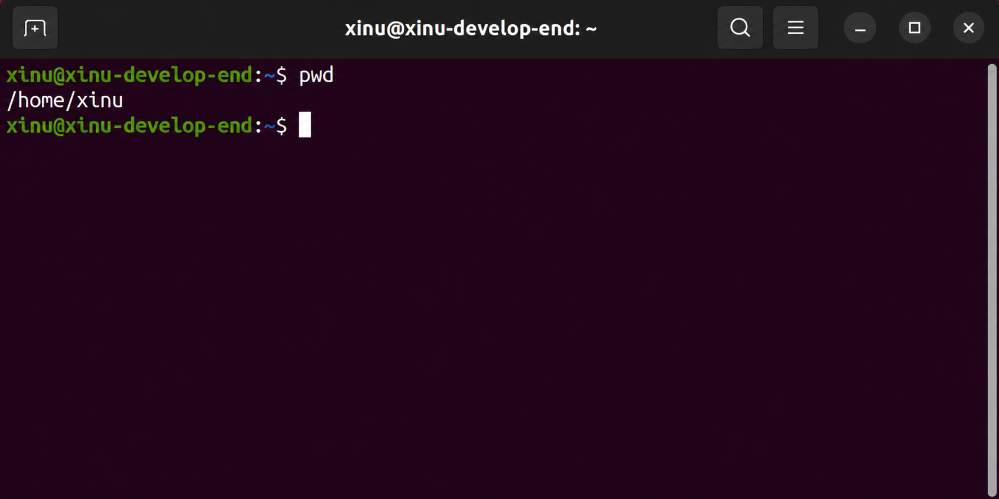

**b. Option dan parameter dari perintah `pwd`:**
- Option: tidak ada
- Parameter: tidak ada

**c. Fungsi perintah `pwd`:**
Menampilkan path absolut (lengkap) dari direktori kerja yang sedang aktif saat ini (Print Working Directory).

---

#### 4. Perpindahan (6 poin)

**a. Jalankan dan screenshot perintah: `cd /`**

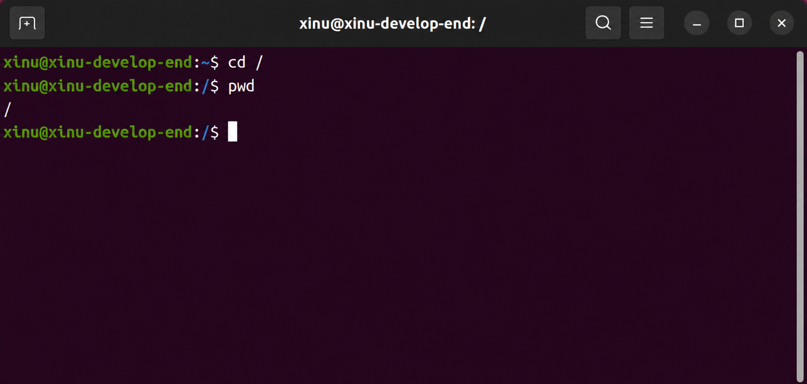

**b. Option dan parameter perintah `cd /`:**
- Option: tidak ada
- Parameter: `/` (direktori tujuan = root)

**c. Yang dilakukan perintah tersebut:**
Perintah `cd /` berfungsi untuk berpindah direktori aktif ke direktori root (`/`), yaitu direktori paling atas dalam struktur hierarki sistem file Linux.

---

#### 5. Direktori Khusus (6 poin)

**a. Lakukan `cd /` kemudian `cd ~`, jelaskan hasilnya!**

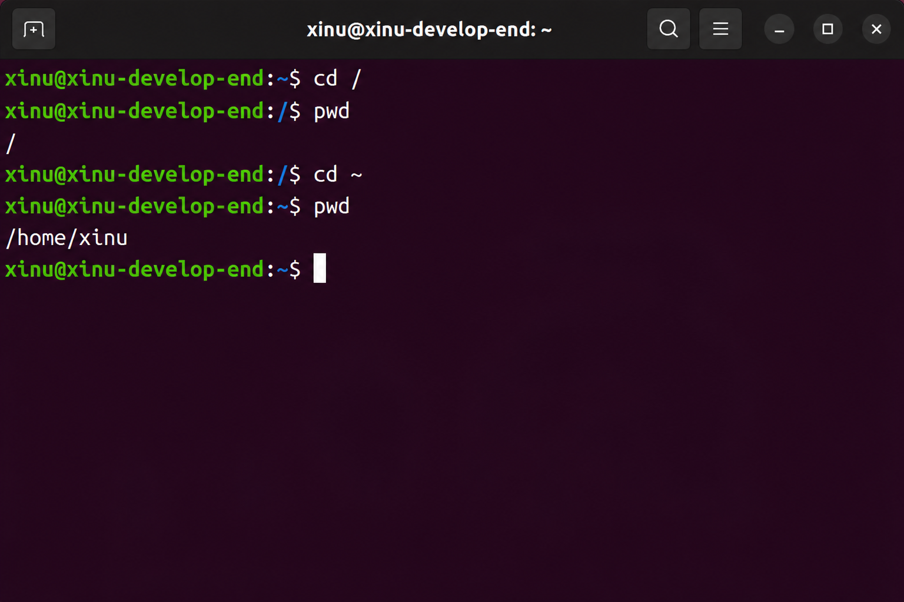

```bash
$ cd /
$ pwd
/
$ cd ~
$ pwd
/home/[username]
```

- `cd /` → berpindah ke direktori root. Hasilnya `pwd` menampilkan `/`
- `cd ~` → berpindah ke home directory user yang login. Hasilnya `pwd` menampilkan `/home/[username]`

Keduanya berbeda karena `/` adalah direktori root (paling atas), sedangkan `~` adalah shortcut menuju direktori home dari user yang sedang aktif.

**b. Berpindah dari `/proc/self` ke `/` menggunakan `cd ..`**

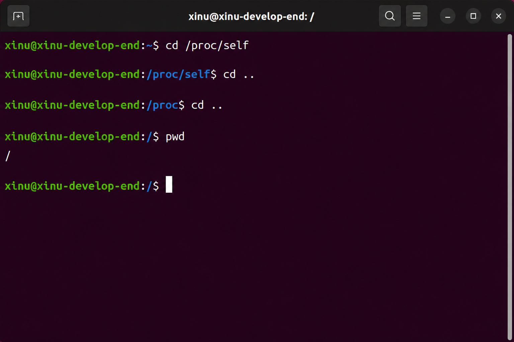

```bash
$ cd /proc/self
$ cd ..     # sekarang di /proc
$ cd ..     # sekarang di /
$ pwd
/
```

Perintah `cd ..` harus dieksekusi **2 kali**:
- Eksekusi ke-1: dari `/proc/self` → berpindah ke `/proc`
- Eksekusi ke-2: dari `/proc` → berpindah ke `/` (root)

---

#### 6. Copy, Rename, dan Delete File (14 poin)

**a. Copy file `/proc/cpuinfo` ke folder home**


```bash
$ cp /proc/cpuinfo /home/[username]/
```

**b. Verifikasi file cpuinfo ada di folder home**

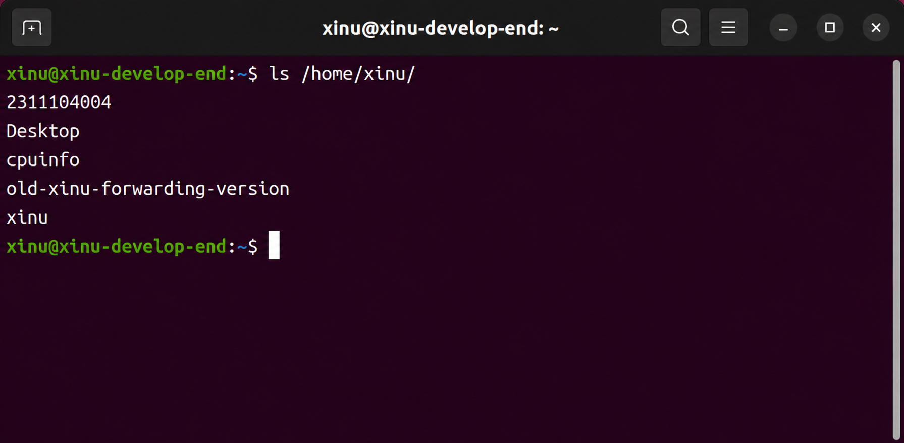

```bash
$ ls /home/[username]/
```

**c. Copy file `/proc/uptime` ke folder home**

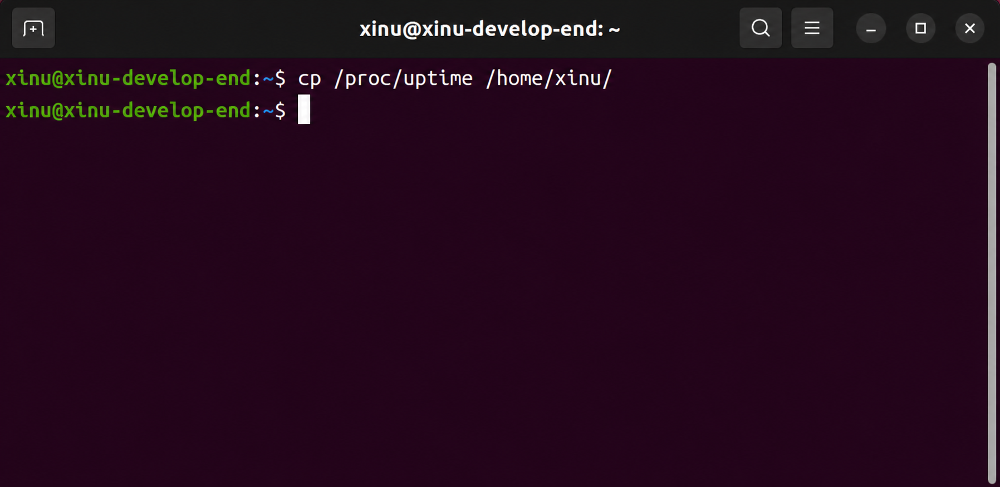

```bash
$ cp /proc/uptime /home/[username]/
```

**d. Verifikasi file uptime ada di folder home**

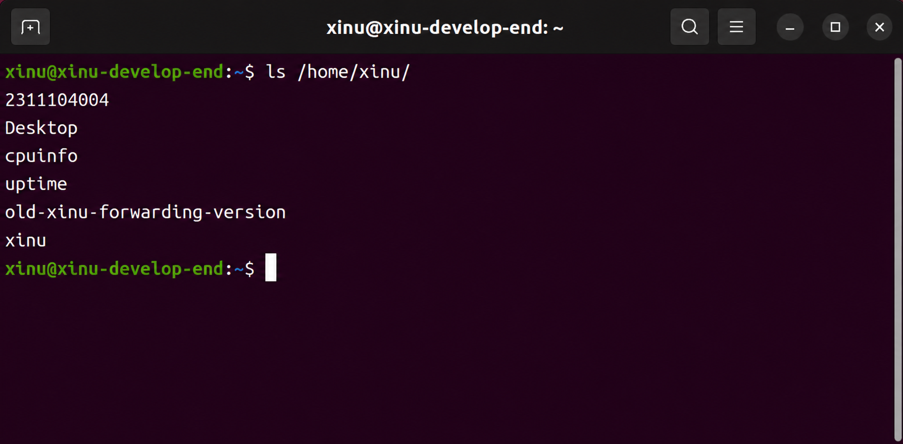

```bash
$ ls /home/[username]/
```

**e. Hapus file uptime di folder home**

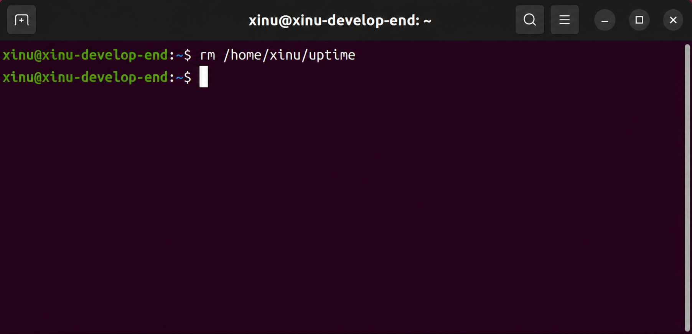

```bash
$ rm /home/[username]/uptime
```

**f. Verifikasi file uptime telah terhapus**

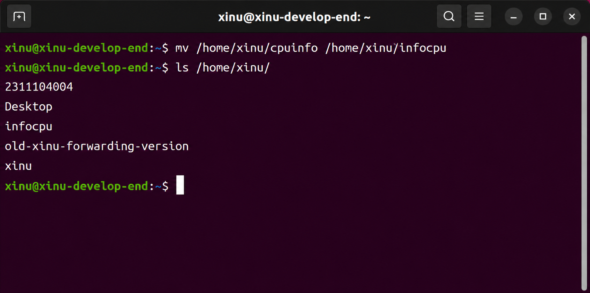

```bash
$ ls /home/[username]/
```

**g. Rename file cpuinfo menjadi infocpu**


```bash
$ mv /home/[username]/cpuinfo /home/[username]/infocpu
$ ls /home/[username]/
```

---

#### 7. Membuat Folder Baru (4 poin)

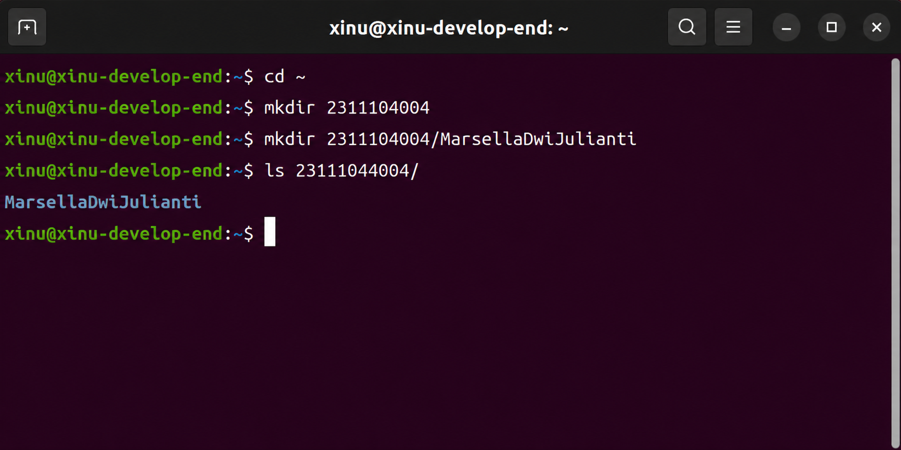

```bash
$ cd ~
$ mkdir 2311104004
$ mkdir 2311104004/MarsellaDwiJulianti
$ ls 2311104004/
```

---

#### 8. Membaca Manual (10 poin)

**a. Buka manual untuk perintah `ls`**

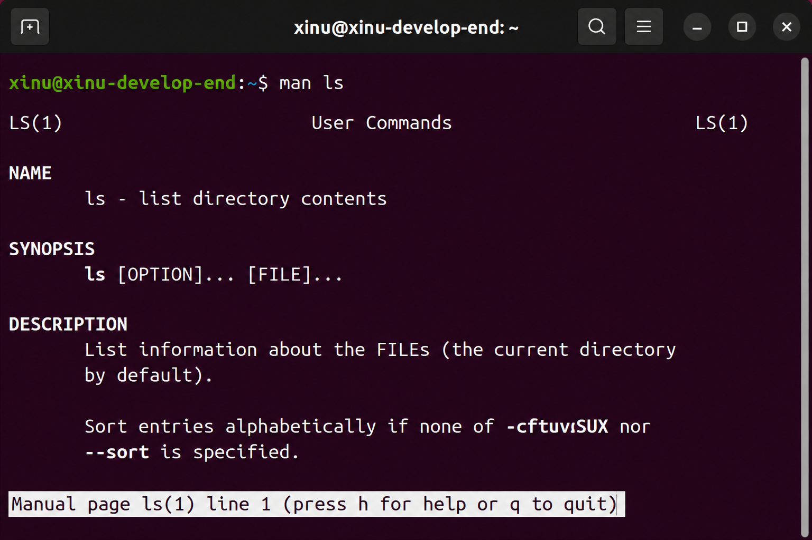

```bash
$ man ls
```

**b. Fungsi perintah `ls`:**
`ls` digunakan untuk menampilkan isi direktori. Tanpa argumen, menampilkan isi direktori saat ini.

**c. Pencipta perintah `ls`:**
Ditulis oleh Richard M. Stallman dan David MacKenzie.

**d. Arti `-h` dari manual ls:**
`-h`, `--human-readable`: Menampilkan ukuran file dalam format mudah dibaca seperti 1K, 234M, 2G (digunakan bersama `-l` atau `-s`).

**e. Option untuk melihat direktori secara rekursif:**
Option `-R` atau `--recursive` digunakan untuk menampilkan subdirektori dan isinya secara rekursif.

**f. Buka manual untuk perintah `cp`**

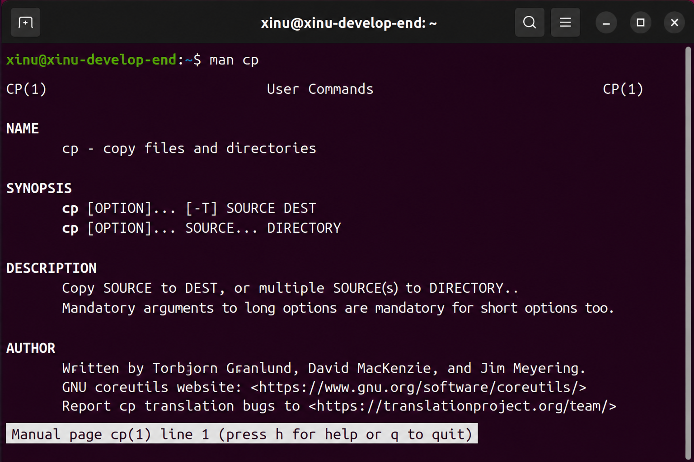

```bash
$ man cp
```

**g. Fungsi perintah `cp`:**
`cp` digunakan untuk menyalin file atau direktori dari sumber ke tujuan.

**h. Pencipta perintah `cp`:**
Ditulis oleh Torbjorn Granlund, David MacKenzie, dan Jim Meyering.

**i. Arti `-v` dalam perintah `cp`:**
`-v`, `--verbose`: Menampilkan nama file yang sedang disalin ke konsol selama proses berlangsung.

**j. Option untuk mode interaktif:**
Option `-i` atau `--interactive`: Meminta konfirmasi terlebih dahulu sebelum menimpa file yang sudah ada di tujuan.

---

#### 9. Pipe (12 poin)

**a. Jalankan dan screenshot: `cat /etc/passwd`**

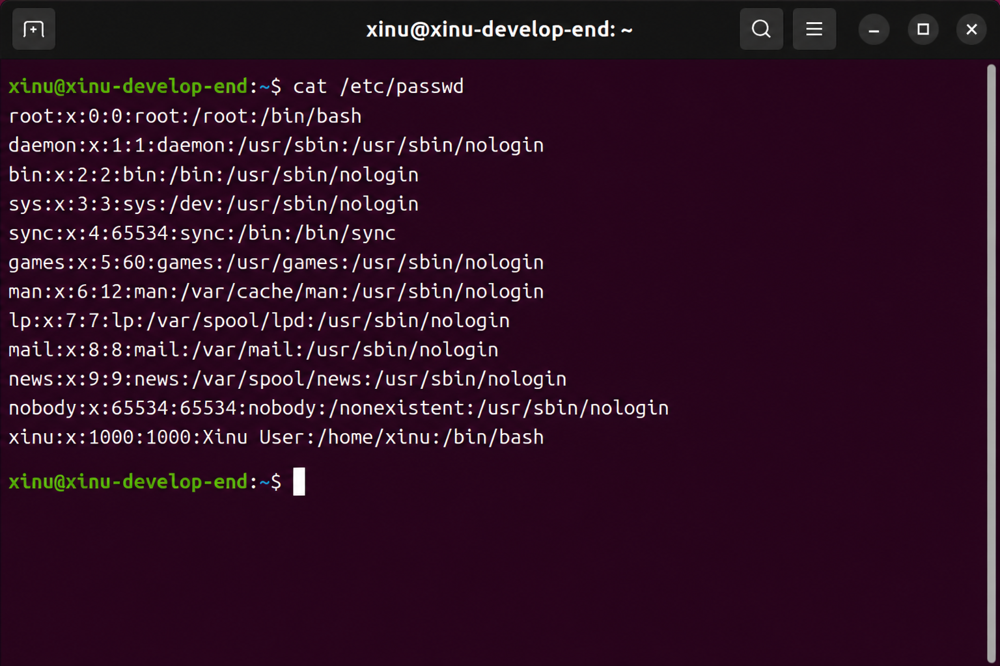

```bash
$ cat /etc/passwd
```

**b. Fungsi perintah `cat`:**
`cat` (concatenate) digunakan untuk menampilkan isi suatu file ke layar terminal secara berurutan.

**c. Jalankan: `cat /etc/passwd | grep daemon`**

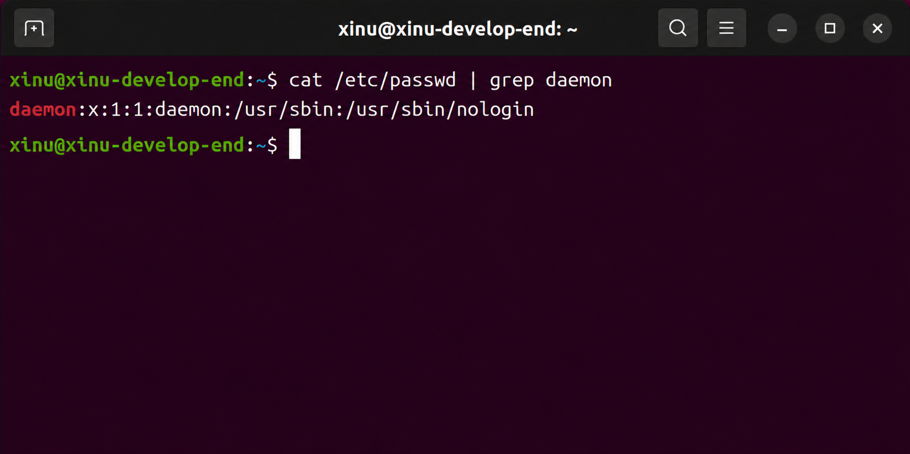

```bash
$ cat /etc/passwd | grep daemon
```

**d. Jalankan: `cat /etc/passwd | grep root`**

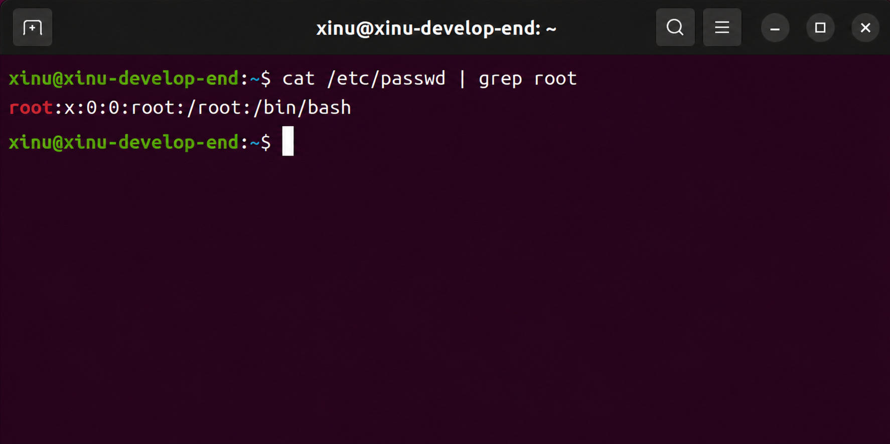

```bash
$ cat /etc/passwd | grep root
```

**e. Jalankan: `cat /etc/passwd | grep nobody`**

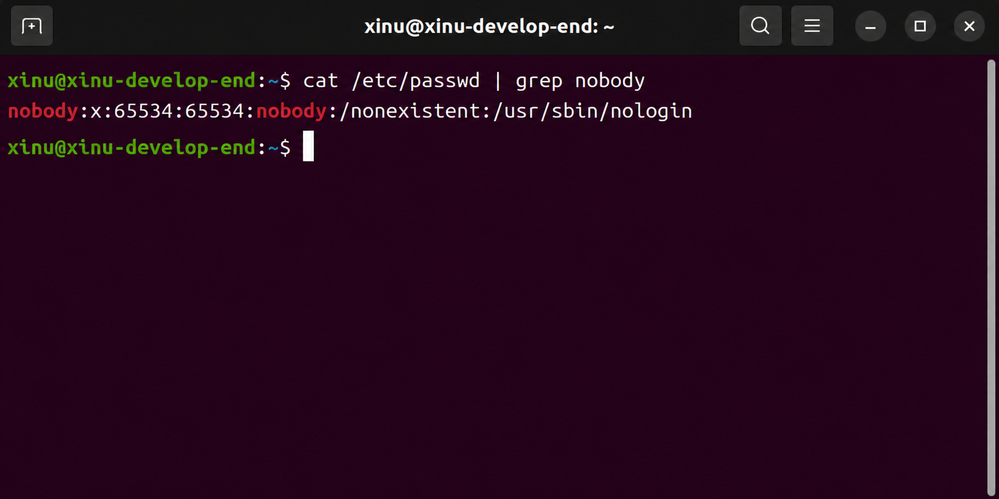

```bash
$ cat /etc/passwd | grep nobody
```

**f. Fungsi perintah `| grep daemon`:**
`|` (pipe) meneruskan output dari `cat /etc/passwd` sebagai input ke `grep daemon`. Perintah `grep daemon` kemudian memfilter dan hanya menampilkan baris yang mengandung kata "daemon", sehingga dari seluruh isi `/etc/passwd` hanya baris yang berkaitan dengan user daemon yang ditampilkan.

---

#### 10. Redirection (14 poin)

**a. Jalankan dan jelaskan: `cd /` kemudian `ls -al > /home/[username]/result.txt`**

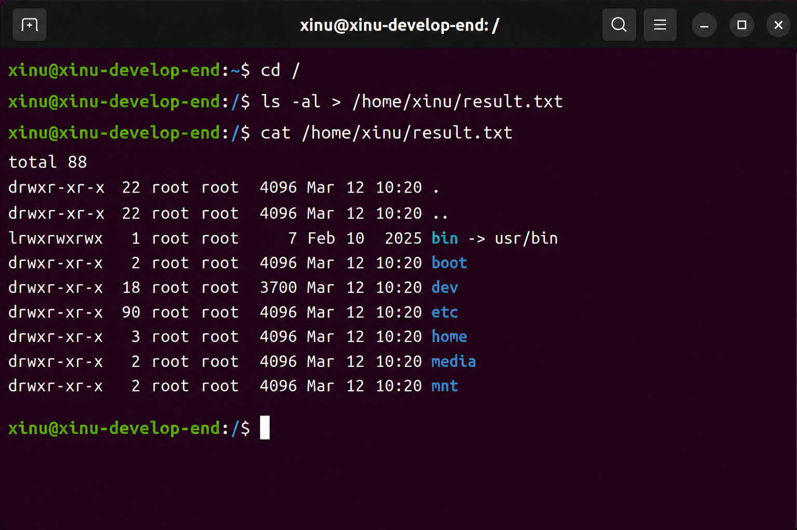

```bash
$ cd /
$ ls -al > /home/[username]/result.txt
$ cat /home/[username]/result.txt
```

**Penjelasan:** Output dari `ls -al` (daftar isi direktori `/` secara detail) tidak ditampilkan di terminal, melainkan disimpan ke dalam file `result.txt`. File dibuat otomatis jika belum ada.

**b. Lokasi file result.txt:**
File berada di `/home/[username]/result.txt`

**c. Jalankan dan jelaskan: `cd /etc` kemudian `ls -al > /home/[username]/result.txt`**

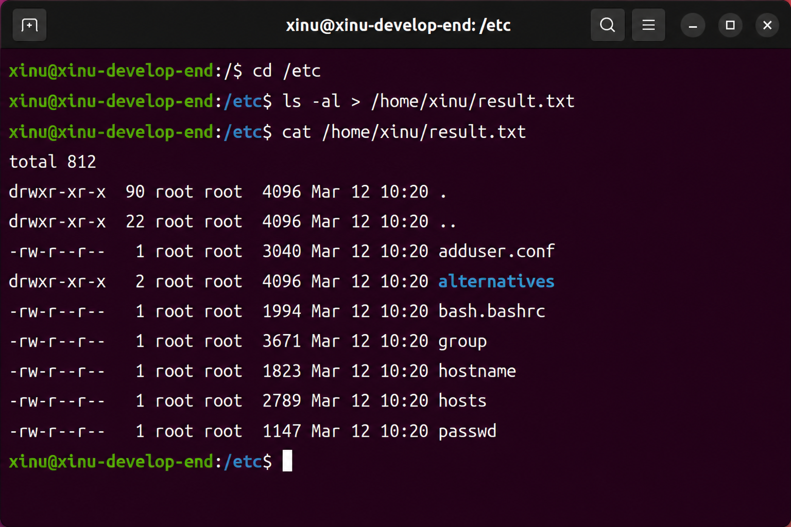

```bash
$ cd /etc
$ ls -al > /home/[username]/result.txt
$ cat /home/[username]/result.txt
```

**Penjelasan:** Output `ls -al` dari direktori `/etc` disimpan ke `result.txt`. Isi sebelumnya (daftar `/`) **ditimpa (overwrite)** dan diganti dengan daftar isi `/etc` karena menggunakan operator `>`.

**d. Fungsi perintah `>`:**
Operator `>` mengarahkan output suatu perintah untuk disimpan ke dalam sebuah file. Jika file sudah ada, isinya akan **ditimpa (overwrite)**. Jika belum ada, file baru akan dibuat.

**e. Jalankan dan jelaskan: `cd /` kemudian `ls -al >> /home/[username]/result1.txt`**

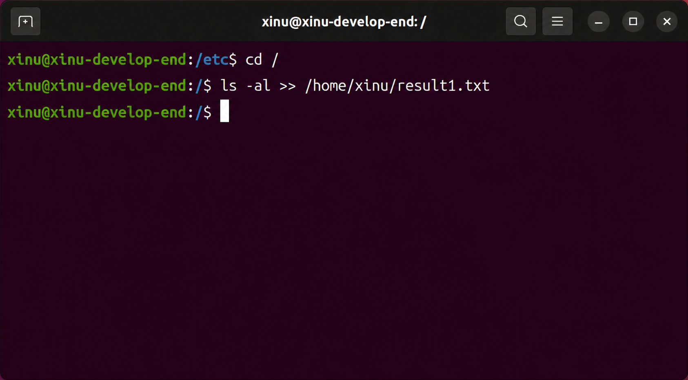

```bash
$ cd /
$ ls -al >> /home/[username]/result1.txt
```

**Penjelasan:** Output `ls -al` dari `/` ditambahkan (append) ke dalam `result1.txt`. Jika file belum ada, file baru dibuat.

**f. Jalankan dan jelaskan: `cd /etc` kemudian `ls -al >> /home/[username]/result1.txt`**

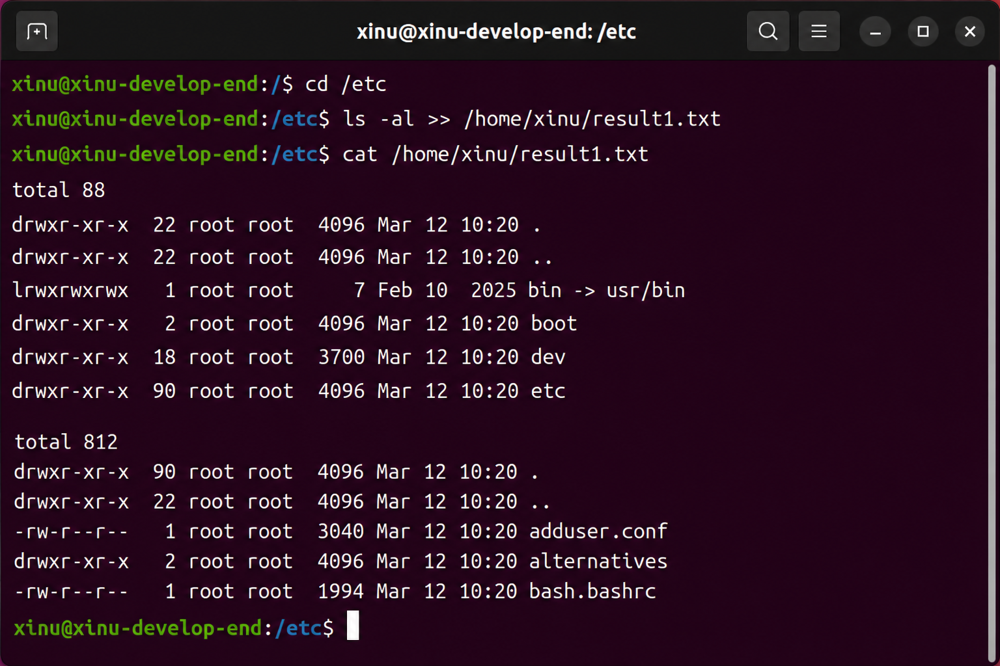

```bash
$ cd /etc
$ ls -al >> /home/[username]/result1.txt
$ cat /home/[username]/result1.txt
```

**Penjelasan:** Output `ls -al` dari `/etc` **ditambahkan di akhir** `result1.txt` tanpa menghapus isi sebelumnya. Sehingga file kini berisi daftar `/` dilanjutkan daftar `/etc`.

**g. Perbedaan `>` dan `>>`:**

| Operator | Nama | Perilaku |
|----------|------|----------|
| `>` | Overwrite | Menimpa isi file lama dengan output baru |
| `>>` | Append | Menambahkan output baru di akhir file tanpa menghapus isi lama |

---

### II. Kompile Source Code (Total 17 Poin)

> **Catatan:** Pastikan gcc sudah terinstall dengan `gcc --version`
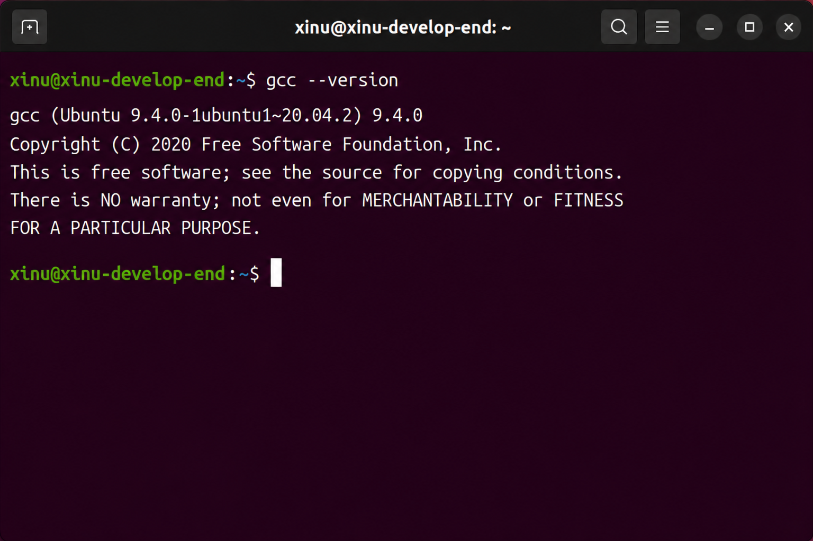

---

#### 1. Buat file `2_1.c`

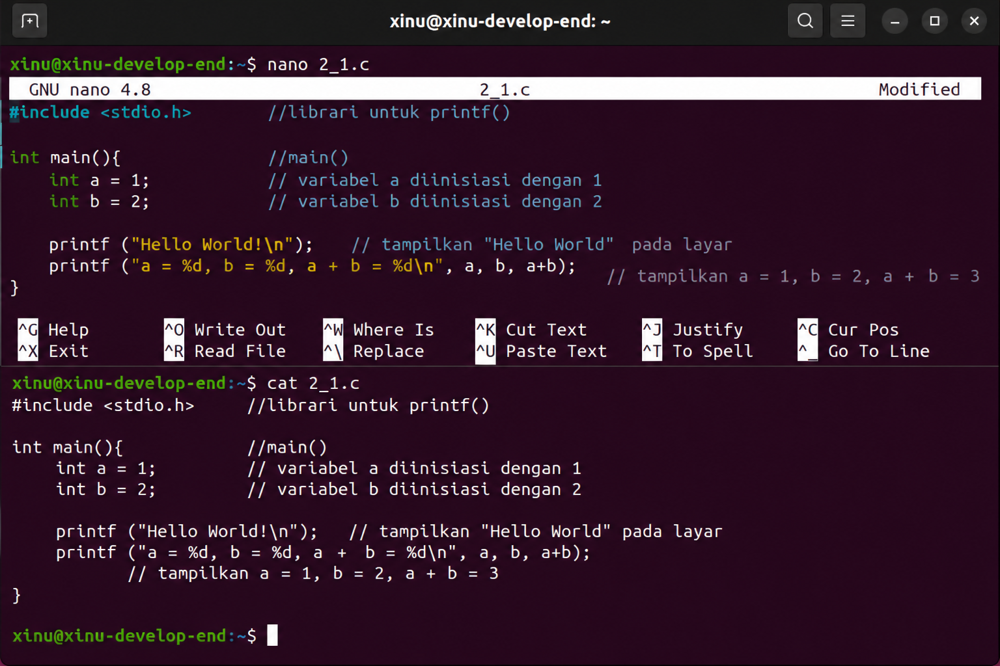

```bash
$ nano 2_1.c
```

Isi file `2_1.c`:

```c
#include <stdio.h>      //librari untuk printf()
int main(){             //main()
    int a = 1;          // variabel a diinisiasi dengan 1
    int b = 2;          // variabel b diinisiasi dengan 2
    printf ("Hello World!\n");    // tampilkan "Hello World" pada layar
    printf ("a = %d, b = %d, a + b = %d\n", a, b, a+b);
    // tampilkan a = 1, b = 2, a + b = 3
}
```

---

#### 2. Kompile `2_1.c` menggunakan gcc

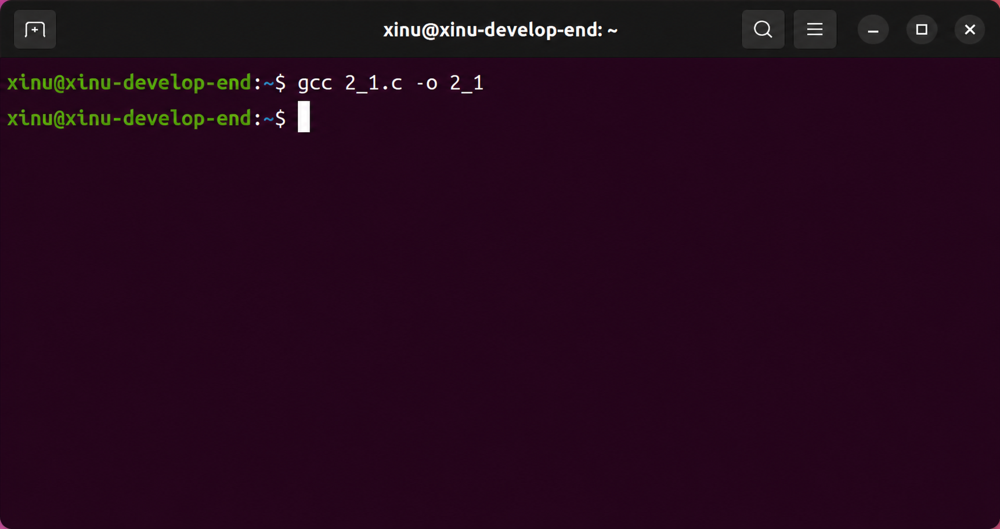

Perintah untuk mengkompile:

```bash
$ gcc 2_1.c -o 2_1
```

---

#### 3. Jalankan program `2_1`

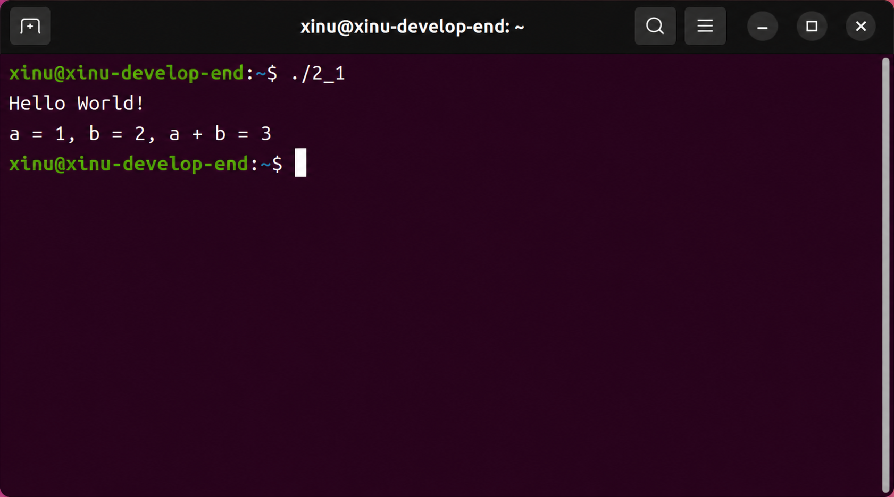

Perintah untuk menjalankan:

```bash
$ ./2_1
```

---

#### 4. Buat file `2_2.c`

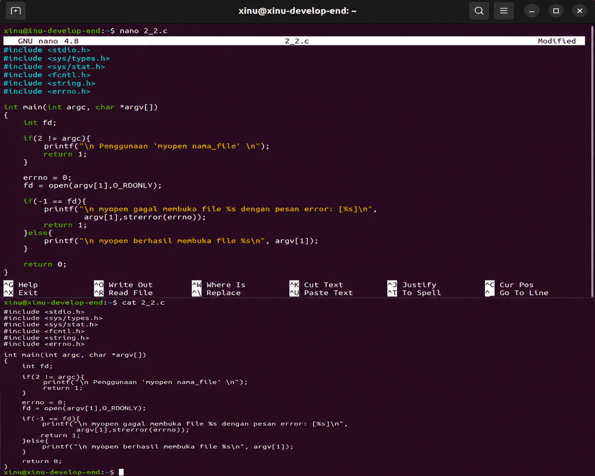

```bash
$ nano 2_2.c
```

Isi file `2_2.c`:

```c
#include <stdio.h>
#include <sys/types.h>
#include <sys/stat.h>
#include <fcntl.h>
#include <string.h>
#include <errno.h>
int main(int argc, char *argv[])
{
    int fd;
    if(2 != argc){
        printf("\n Penggunaan 'myopen nama_file' \n");
        return 1;
    }
    errno = 0;
    fd = open(argv[1],O_RDONLY);
    if(-1 == fd){
        printf("\n myopen gagal membuka file %s dengan pesan error: [%s]\n",
               argv[1],strerror(errno));
        return 1;
    }else{
        printf("\n myopen berhasil membuka file %s\n", argv[1]);
    }
    return 0;
}
```

---

#### 5. Kompile `2_2.c` menggunakan gcc dengan nama output `myopen`

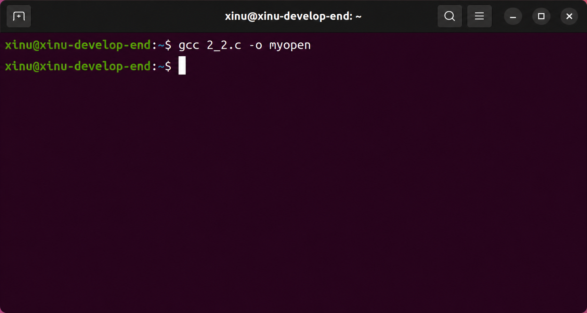

Perintah untuk mengkompile:

```bash
$ gcc 2_2.c -o myopen
```

---

#### 6. Jalankan program `myopen`

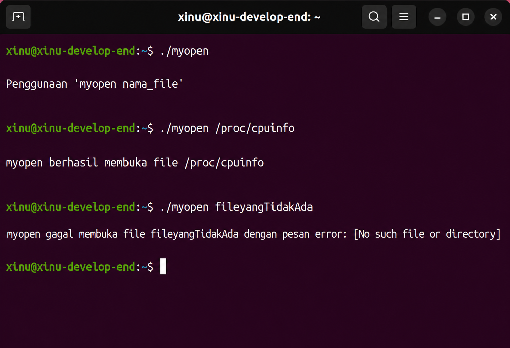

Perintah untuk menjalankan:

```bash
$ ./myopen
$ ./myopen /proc/cpuinfo
$ ./myopen fileyangTidakAda
```

---

#### 7. Penjelasan program `myopen`

Program `myopen` adalah program yang mencoba membuka file yang diberikan sebagai argumen menggunakan system call `open()` dengan mode read-only (`O_RDONLY`). Cara kerjanya:

1. Program memeriksa jumlah argumen – jika tidak tepat 2 (nama program + nama file), maka menampilkan petunjuk penggunaan dan keluar
2. Jika argumen benar, program mencoba membuka file yang disebutkan
3. Jika berhasil dibuka, program mencetak pesan sukses
4. Jika gagal (misalnya file tidak ditemukan atau tidak punya izin), program mencetak pesan error beserta keterangan error dari sistem (`strerror(errno)`)

---

## Referensi

1. Modul Praktikum Sistem Operasi, Fakultas Informatika Telkom University, 2024
2. GNU Coreutils Manual – https://www.gnu.org/software/coreutils/manual/
3. Linux man-pages – https://man7.org/linux/man-pages/
4. GCC, the GNU Compiler Collection – https://gcc.gnu.org/