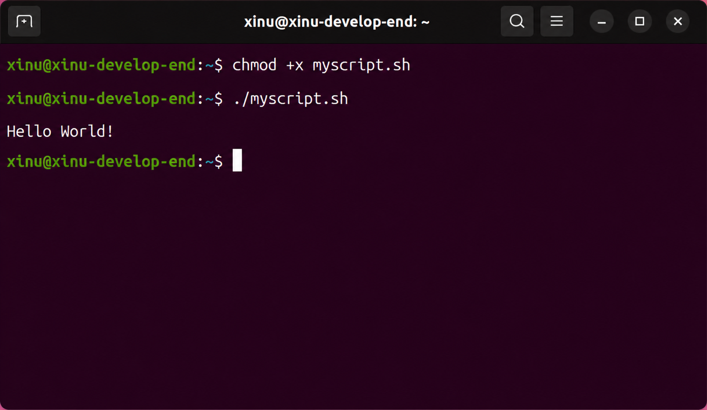
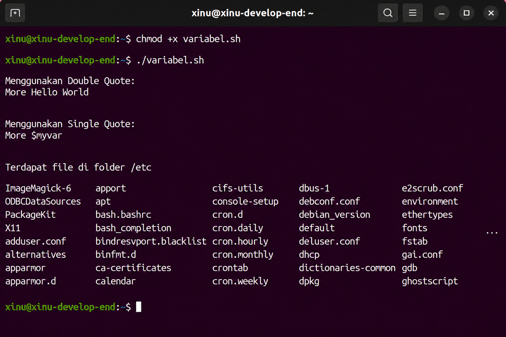
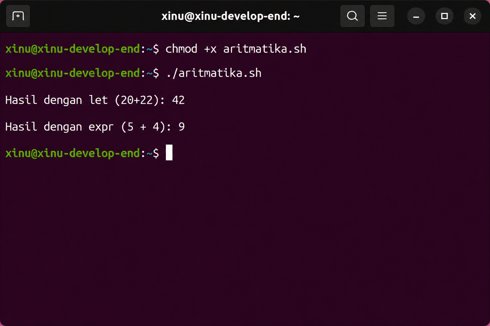
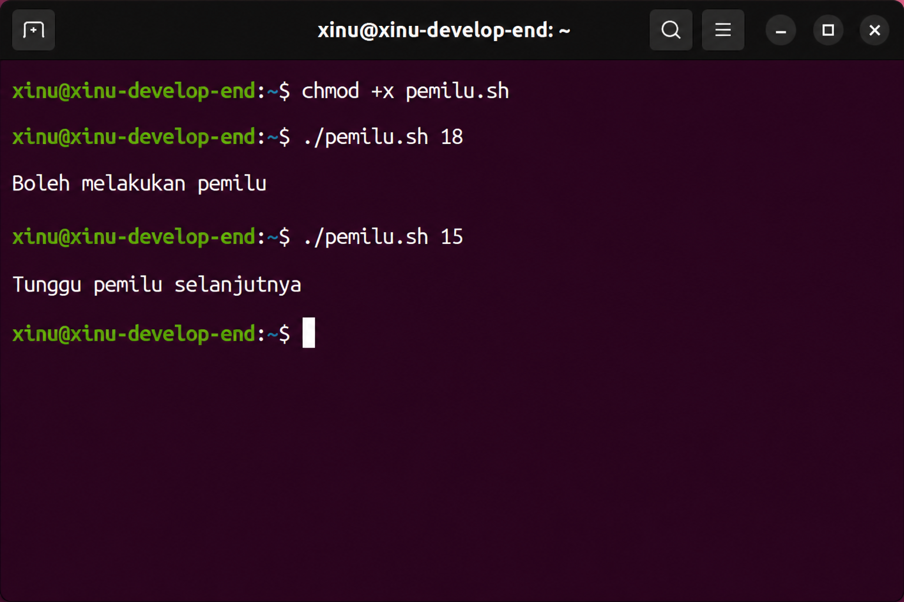
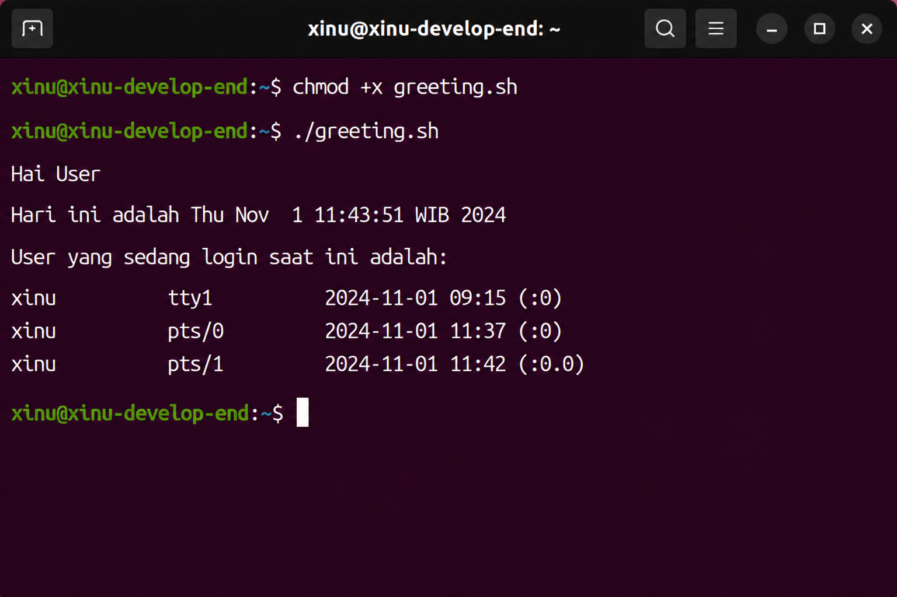
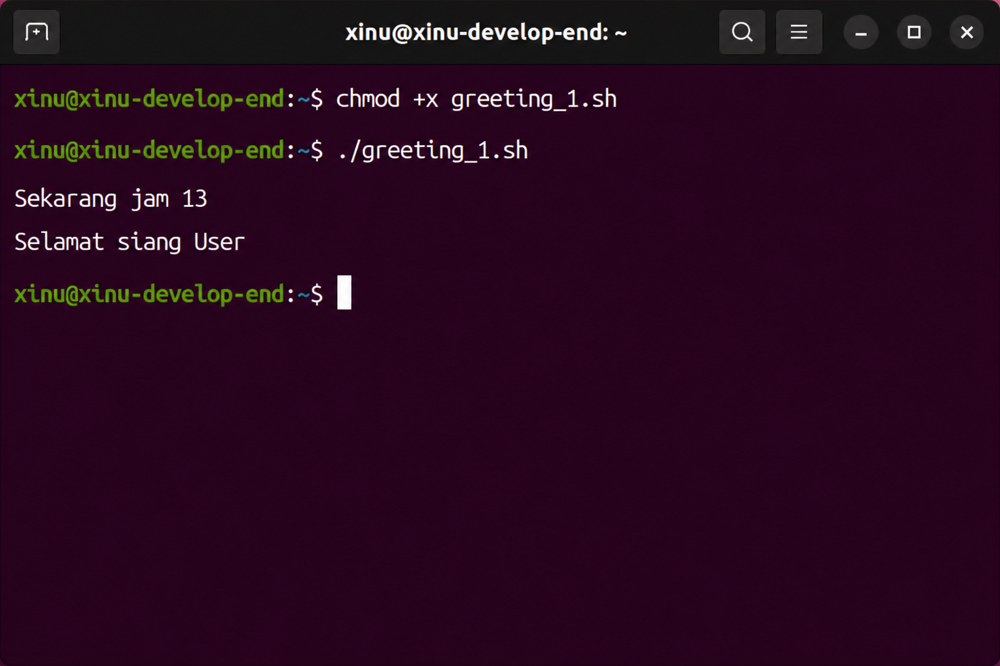
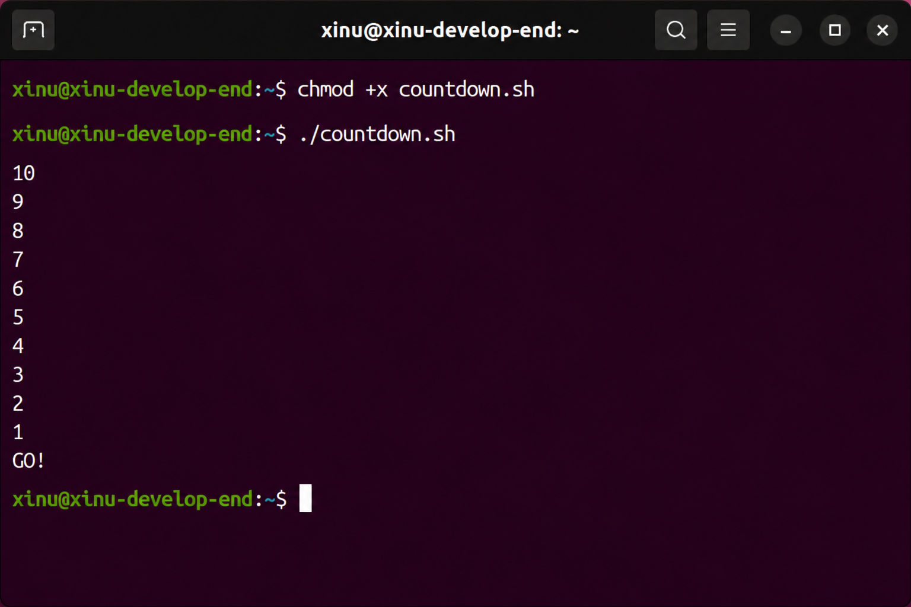
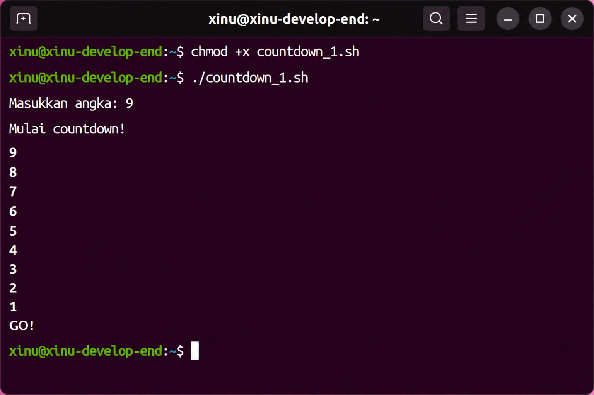
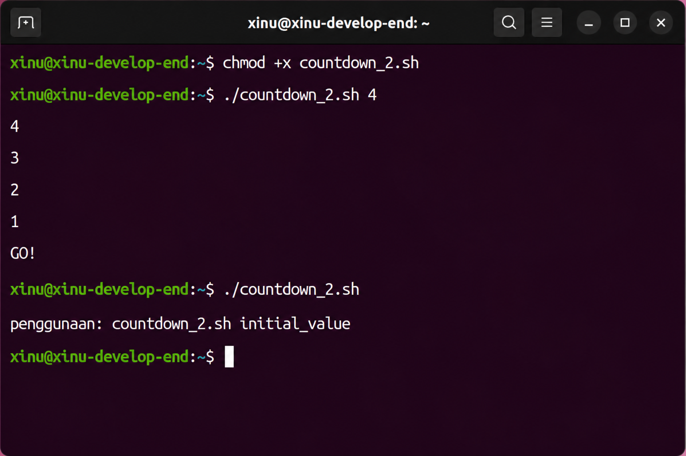
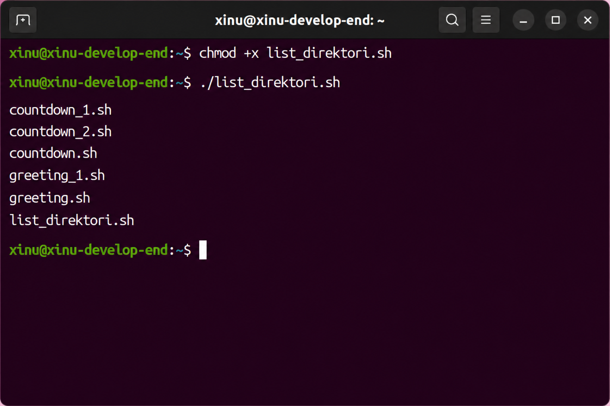

# <h1 align="center" style="font-family: 'Google Sans', sans-serif;">Laporan Praktikum Modul 14 <br> Scripting</h1>
<p align="center" style="font-family: 'Google Sans', sans-serif;">Salman Alfarisi - 2311104036</p>

## Dasar Teori

Shell Scripting pada sistem operasi Linux merupakan serangkaian perintah yang disimpan ke dalam sebuah file teks biasa (plain text), biasanya memiliki ekstensi `.sh`. Dibandingkan dengan menuliskan perintah satu per satu secara interaktif di terminal, penggunaan script memungkinkan eksekusi urutan perintah secara otomatis dan terstruktur.

Salah satu command line interpreter yang paling populer digunakan di lingkungan Unix/Linux adalah **Bash (Bourne-Again Shell)**. Di dalam pemrograman Bash, terdapat beberapa konsep dasar penting, antara lain:
1. **Shebang (`#!/bin/bash`)**: Baris pertama dalam script yang berfungsi memberi tahu sistem jenis interpreter yang digunakan untuk mengeksekusi script tersebut.
2. **Variabel**: Tempat penyimpanan informasi sementara dengan pola pengisian `nama_variabel=value` tanpa menggunakan spasi di sekitar tanda sama dengan (`=`).
3. **Command Line Arguments**: Parameter eksternal yang dioper ke dalam script saat dijalankan, yang direpresentasikan oleh variabel spesial seperti `$1`, `$2`, s.d. `$9`.
4. **Struktur Pengondisian & Perulangan**: Bash menyediakan fitur pengujian logika melalui struktur `if-then-else-fi` maupun kalang iterasi menggunakan `for`, `while`, dan `until` untuk kontrol alur otomasi program.

---

## Guided

### 1. Struktur Dasar Bash Script (`myscript.sh`)
Pembuatan shell script sederhana untuk menampilkan teks pesan ke layar terminal menggunakan perintah `echo`.

**Kode Program:**
```bash
#!/bin/bash
# A sample Bash script

echo "Hello World!"
```

> **Keterangan Screenshot:**
> *Taruh screenshot terminal di bawah ini yang menampilkan proses perubahan izin file dengan perintah `chmod +x myscript.sh` beserta hasil eksekusinya menggunakan `./myscript.sh`.*


### 2. Penggunaan Variabel dan Subtitusi Komando
Eksperimen membedakan penggunaan *single quote* (`'`) dan *double quote* (`"`) saat pendeklarasian variabel, serta menyimpan output perintah ke dalam variabel (*Command Substitution*).

**Kode Program:**
```bash
#!/bin/bash
myvar='Hello World'
newvar="More $myvar"
newvar1='More $myvar'

echo "Menggunakan Double Quote:"
echo $newvar
echo "Menggunakan Single Quote:"
echo $newvar1

# Command Substitution
myvar_etc=$(ls /etc)
echo "Terdapat file di folder /etc"
```

> **Keterangan Screenshot:**
> *Taruh screenshot terminal hasil pengeksekusian kode variabel di atas yang memperlihatkan perbedaan teks literal pada single quote dan hasil substitusi pada double quote.*


### 3. Implementasi Operasi Aritmatika (`let` dan `expr`)
Melakukan perhitungan matematika di dalam lingkungan Bash menggunakan ekspresi internal `let` maupun utilitas eksternal `expr`.

**Kode Program:**
```bash
#!/bin/bash
# Menggunakan let
let a=20+22
echo "Hasil dengan let (20+22): $a"

# Menggunakan expr (perhatikan spasi wajib antar item)
hasil_expr=$(expr 5 + 4)
echo "Hasil dengan expr (5 + 4): $hasil_expr"
```

> **Keterangan Screenshot:**
> *Taruh screenshot terminal yang menunjukkan hasil kalkulasi aritmatika dari eksekusi script di atas.*


### 4. Statement Pengondisian `If`
Mengevaluasi kondisi argumen masukan numerik untuk menentukan hak partisipasi pemilu.

**Kode Program:**
```bash
#!/bin/bash
if [ $1 -ge 17 ]
then
    echo "Boleh melakukan pemilu"
else
    echo "Tunggu pemilu selanjutnya"
fi
```

> **Keterangan Screenshot:**
> *Taruh screenshot terminal yang menguji program di atas dengan dua argumen berbeda, misalnya: `./script.sh 18` dan `./script.sh 15`.*


---

## Unguided

### 1. Scripting Permulaan — Menyapa User (`greeting.sh`)
Program Bash Scripting yang ditujukan untuk menyapa user, mencetak tanggal/waktu sistem saat ini, serta mendaftar siapa saja user yang sedang login aktif ke dalam sistem.

**Kode Program (`greeting.sh`):**
```bash
#!/bin/bash

# Menyapa user
echo "Hai User"

# Menampilkan tanggal hari ini
echo "Hari ini adalah $(date)"

# Menampilkan user yang sedang login saat ini
echo "User yang sedang login saat ini adalah:"
who
```

> **Keterangan Screenshot:**
> *Taruh screenshot di sini yang membuktikan kesuksesan eksekusi `./greeting.sh` dengan keluaran teks sapaan beserta daftar user aktif.*


### 2. Pengondisian Menggunakan Waktu Jam Sistem (`greeting_1.sh`)
Script kondisional yang dinamis mengeluarkan frasa salam ("selamat pagi", "selamat siang", "selamat sore", atau "selamat malam") disandarkan pada jam waktu lokal sistem berjalan.

**Kode Program (`greeting_1.sh`):**
```bash
#!/bin/bash

# Mendapatkan jam saat ini dalam format 24 jam (0-23)
jam=$(date +%k | tr -d ' ')

echo "Sekarang jam $jam"

if [ $jam -gt 5 ] && [ $jam -le 10 ]; then
    echo "Selamat pagi User"
elif [ $jam -gt 10 ] && [ $jam -le 15 ]; then
    echo "Selamat siang User"
elif [ $jam -gt 15 ] && [ $jam -le 19 ]; then
    echo "Selamat sore User"
else
    echo "Selamat malam User"
fi
```

> **Keterangan Screenshot:**
> *Taruh screenshot di sini berupa hasil eksekusi `./greeting_1.sh`. Pastikan output logika "Selamat ..." sesuai dengan waktu jam komputer saat Anda menjalankan praktikum.*


### 3. Perulangan Mundur Statis (`countdown.sh`)
Program kalang iterasi yang melakukan perhitungan mundur terhitung secara statis dari angka 10 menuju angka 1 lalu diakhiri oleh interjeksi "GO!".

**Kode Program (`countdown.sh`):**
```bash
#!/bin/bash

for (( i=10; i>=1; i-- ))
do
    echo $i
    sleep 0.5 # Opsional: jeda setengah detik agar efek countdown terasa
done

echo "GO!"
```

> **Keterangan Screenshot:**
> *Taruh screenshot terminal yang menangkap barisan angka berurutan turun dari 10 hingga 1 dan teks "GO!" di akhir eksekusi file `countdown.sh`.*


### 4. Perulangan Berdasarkan Input Pengguna (`countdown_1.sh`)
Program otomasi hitung mundur dinamis interaktif yang batasan nilai mulanya ditangkap langsung dari masukan angka pengguna via terminal.

**Kode Program (`countdown_1.sh`):**
```bash
#!/bin/bash

echo -n "Masukkan angka: "
read angka

echo "Mulai countdown!"

while [ $angka -ge 1 ]
do
    echo $angka
    let angka--
done

echo "GO!"
```

> **Keterangan Screenshot:**
> *Taruh screenshot terminal di sini saat program meminta masukan angka dari Anda (contoh memasukkan angka 9) beserta deret output angka mundurnya.*


### 5. Hitung Mundur Melalui Parameter Script (`countdown_2.sh`)
Script hitung mundur berbasis penanganan *Command Line Parameter* dengan tambahan fungsi validasi error apabila user alpa menyertakan parameter masukan awal.

**Kode Program (`countdown_2.sh`):**
```bash
#!/bin/bash

# Memeriksa apakah jumlah argumen ($#) sama dengan 0
if [ $# -eq 0 ]; then
    echo "penggunaan: countdown_2.sh initial_value"
    exit 1
fi

angka=$1

while [ $angka -ge 1 ]
do
    echo $angka
    let angka--
done

echo "GO!"
```

> **Keterangan Screenshot:**
> *Taruh screenshot pengujian ganda di sini: (1) Saat dipanggil tanpa parameter `./countdown_2.sh` yang memicu pesan instruksi penggunaan, dan (2) Saat dipanggil sukses dengan parameter, misal `./countdown_2.sh 4`.*


### 6. Loop Iterasi Daftar Direktori (`list_direktori.sh`)
Pemanfaatan struktur kontrol kalang `for in` dengan wildcard karakter khusus `*` untuk mendaftar dan menampilkan seluruh file yang berada di dalam direktori kerja aktif saat ini.

**Kode Program (`list_direktori.sh`):**
```bash
#!/bin/bash

# Iterasi menggunakan wildcard asterisk (*) untuk membaca isi direktori
for file in *
do
    echo "$file"
done
```

> **Keterangan Screenshot:**
> *Taruh screenshot di sini yang membuktikan keluaran list file dari pengeksekusian script `./list_direktori.sh`.*


---

## Referensi
1. `[IF] Modul Praktikum Sistem Operasi.pdf` - Laboratorium Informatika Universitas Telkom
2. `[REG] JURNAL MODUL 15.pdf` - Jurnal Praktikum Scripting Sistem Operasi