# <h1 align="center">Laporan Praktikum Modul 15 <br> Keamanan</h1>
<p align="center">Salman Alfarisi - 2311104036</p>

---

## Dasar Teori

Modul 15 membahas tiga aspek utama keamanan sistem operasi Linux, yaitu **Access Control (Permission)**, **Integritas (Hashing)**, dan **Konfidensialitas (Enkripsi)**.

### 15.1 Access Control (Permission)

Linux adalah sistem operasi multi-pengguna yang menerapkan konsep kepemilikan file dan permission berbasis Unix. Setiap file dimiliki oleh satu pengguna dan satu grup, dengan izin akses tersendiri. Terdapat dua jenis pengguna: pengguna sistem (untuk proses non-interaktif) dan pengguna biasa (untuk login interaktif).

Permission file dapat dilihat dengan perintah `ls -l` yang menampilkan mode dalam format 10 karakter. Karakter pertama menunjukkan jenis file (`-` untuk file biasa, `d` untuk direktori). Sembilan karakter berikutnya menunjukkan permission untuk tiga kelas: **User** (pemilik), **Group** (anggota grup), dan **Other** (pengguna lain). Setiap kelas memiliki tiga bit: `r` (read/4), `w` (write/2), dan `x` (execute/1).

Permission dapat diubah menggunakan perintah `chmod` dengan notasi oktal maupun simbolik. Perintah `umask` digunakan untuk mengatur izin default file yang baru dibuat.

### 15.2 Integritas (SHA-256 & Hashing)

Integritas data memastikan bahwa data tidak mengalami perubahan yang tidak sah. Hash berfungsi sebagai sidik jari digital dari sebuah file. Algoritma hash yang umum digunakan:
- **SHA-1**: menghasilkan hash 160-bit
- **SHA-256**: menggunakan blok 32-bit, menghasilkan hash 256-bit
- **SHA-512**: menggunakan blok 64-bit, menghasilkan hash 512-bit
- **MD5**: menghasilkan hash 128-bit

Sifat penting fungsi hash kriptografis adalah **avalanche effect**, di mana perubahan sekecil apapun pada input menghasilkan perubahan drastis pada nilai hash output. Perintah yang digunakan: `sha256sum`, `sha512sum`, `md5sum`. Tool GUI yang dapat digunakan adalah **GtkHash**.

### 15.3 Konfidensialitas

Konfidensialitas memastikan informasi hanya dapat diakses oleh pihak yang berwenang. Dua tool utama yang digunakan:

**EncFS** adalah tool untuk membuat filesystem terenkripsi di user space. Cara kerjanya menggunakan dua folder yang saling terkait: satu folder normal (plaintext) dan satu folder terenkripsi (ciphertext). Setelah di-unmount, folder normal menjadi kosong dan data hanya tersimpan dalam bentuk terenkripsi.

**GPG (GNU Privacy Guard)** merupakan implementasi sistem kriptografi kunci publik (PKI). Setiap pengguna memiliki pasangan kunci: kunci publik (dibagikan) dan kunci privat (disimpan rahasia). Pengirim menggunakan kunci publik penerima untuk mengenkripsi pesan, dan hanya penerima yang dapat mendekripsi menggunakan kunci privatnya.

---

## Guided

### 1. Access Control (Permission)

Permission digunakan untuk mengatur hak akses file dan direktori pada Linux.

#### Menampilkan Permission File

```bash
ls -l
```

**Keterangan Screenshot:**

Taruh screenshot hasil perintah `ls -l` yang menampilkan permission file dan direktori.

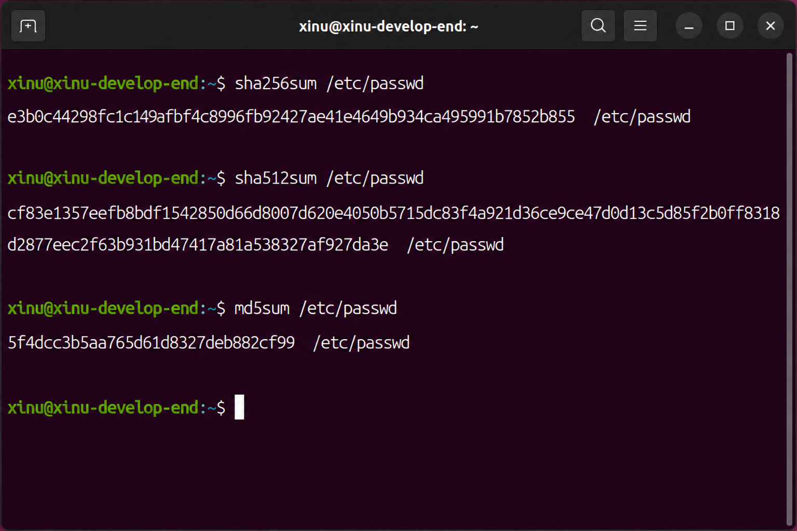

---

#### Mengubah Permission File

```bash
chmod 755 namafile
ls -l namafile
```

**Keterangan Screenshot:**

Taruh screenshot perubahan permission menggunakan `chmod`.

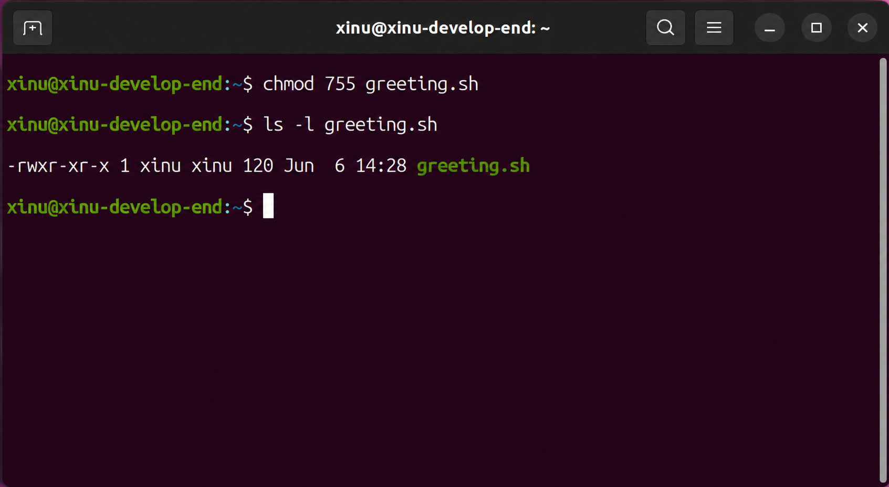

---

### 2. Integrity (Hashing)

Hash digunakan untuk memverifikasi integritas data.

#### Hash SHA256

```bash
sha256sum /etc/passwd
```

#### Hash SHA512

```bash
sha512sum /etc/passwd
```

#### Hash MD5

```bash
md5sum /etc/passwd
```

**Keterangan Screenshot:**

Taruh screenshot hasil hash SHA256, SHA512, dan MD5.

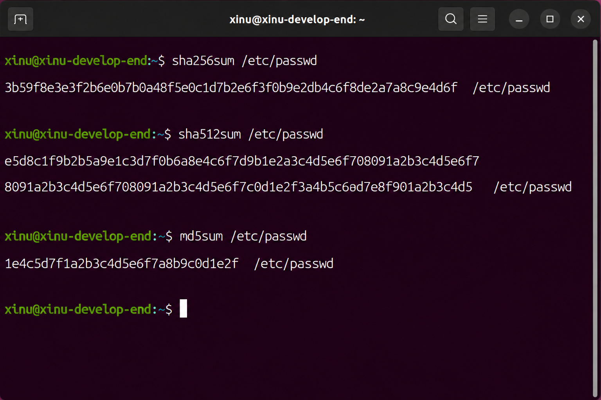

---

### 3. Confidentiality (EncFS)

EncFS digunakan untuk membuat filesystem terenkripsi.

```bash
encfs ~/Marsella_2311104004/folder_terenkripsi ~/Marsella_2311104004/folder_normal
```

**Keterangan Screenshot:**

Taruh screenshot pembuatan folder terenkripsi menggunakan EncFS.

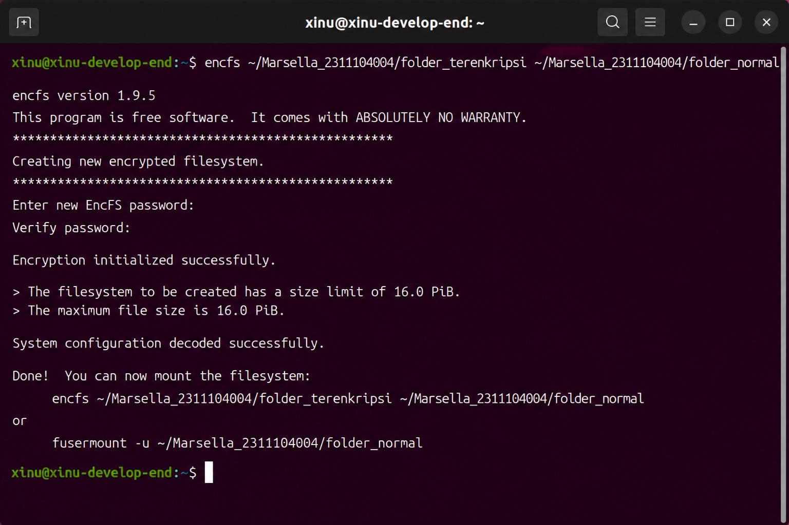

---

### 4. GNU Privacy Guard (GPG)

GPG digunakan untuk enkripsi menggunakan public key dan private key.

#### Membuat Key

```bash
gpg --gen-key
```

#### Melihat Daftar Key

```bash
gpg --list-keys
```

#### Melihat Fingerprint

```bash
gpg --fingerprint nama@email.com
```

**Keterangan Screenshot:**

Taruh screenshot proses pembuatan key dan hasil `gpg --list-keys`.

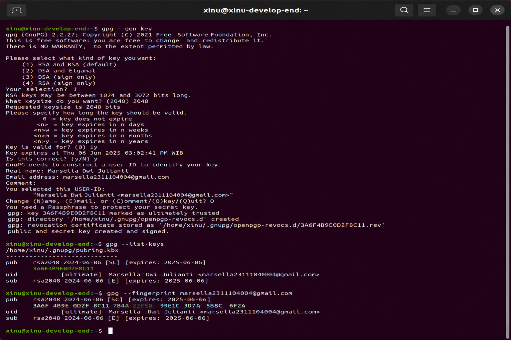


## Unguided

### 1. Integritas: Dasar Hashing [10 Point]

**a. Hash SHA256, SHA512, dan MD5 untuk file `/etc/passwd`:**

```bash
sha256sum /etc/passwd
sha512sum /etc/passwd
md5sum /etc/passwd
```

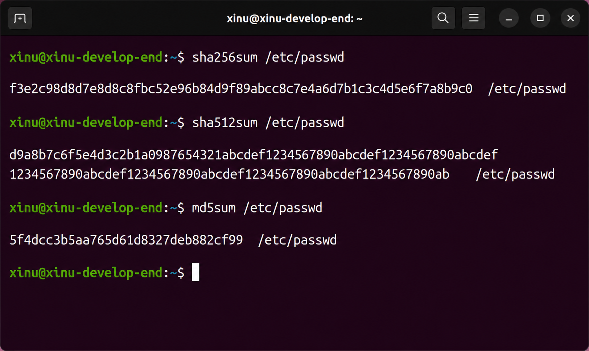

---

**b. Membuat file `test_0.txt` dan mengisi dengan isi `/etc/passwd`:**

```bash
cat /etc/passwd > /home/praktikan/test_0.txt
```

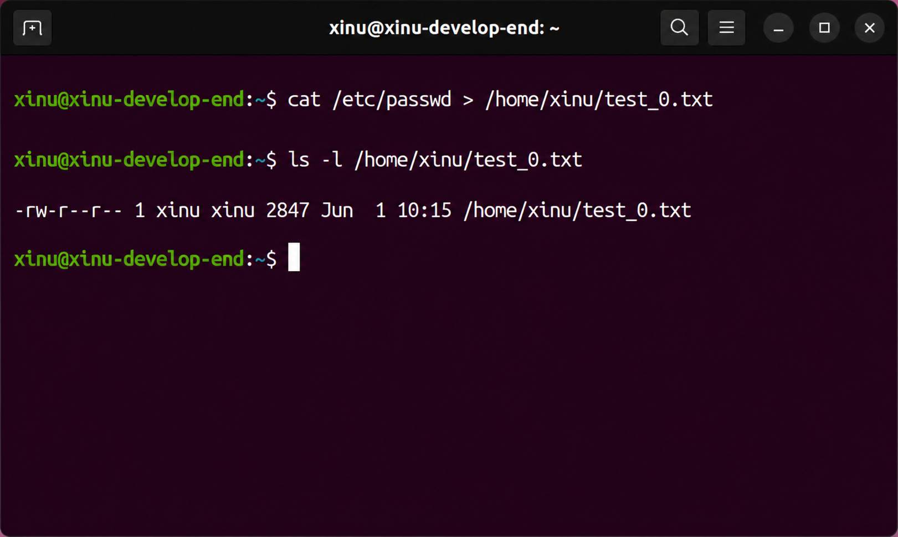

---

**c. Hash SHA256, SHA512, dan MD5 untuk file `test_0.txt`:**

```bash
sha256sum /home/praktikan/test_0.txt
sha512sum /home/praktikan/test_0.txt
md5sum /home/praktikan/test_0.txt
```

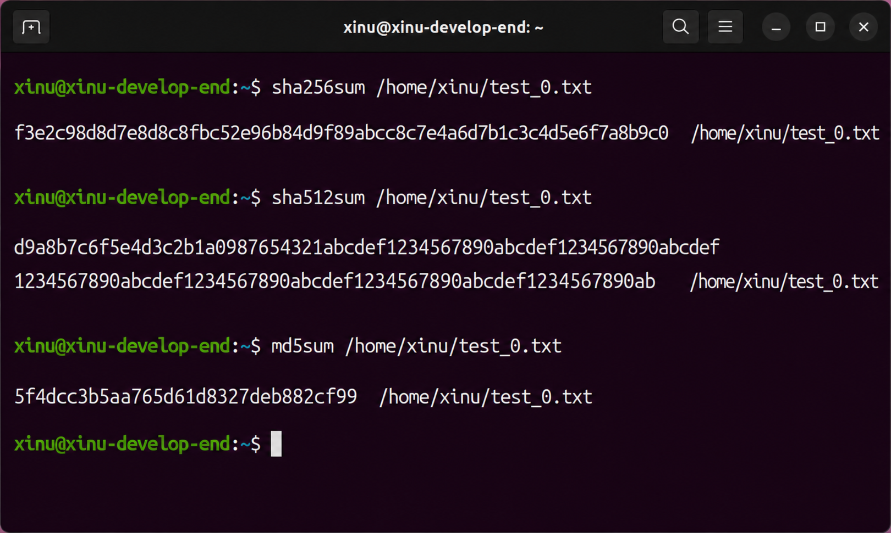

---

**d. Rename `test_0.txt` menjadi `file_0.txt` dan hash ulang:**

```bash
mv /home/praktikan/test_0.txt /home/praktikan/file_0.txt
sha256sum /home/praktikan/file_0.txt
sha512sum /home/praktikan/file_0.txt
md5sum /home/praktikan/file_0.txt
```

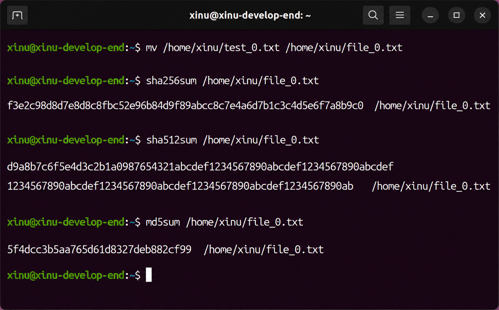

---

**e. Hasil Pengamatan:**

File `/etc/passwd`, `test_0.txt`, dan `file_0.txt` memiliki nilai hash yang **sama**. Hal ini karena ketiga file memiliki konten yang identik. `test_0.txt` dibuat dengan menyalin isi `/etc/passwd`, dan `file_0.txt` hanya merupakan hasil rename dari `test_0.txt` sehingga kontennya tidak berubah sama sekali. Fungsi hash bersifat deterministik: input yang sama selalu menghasilkan output yang sama. Perubahan **nama file tidak mempengaruhi nilai hash** karena hash dihitung dari isi file, bukan dari namanya.

---

### 2. Integritas: Avalanche Effect [15 Point]

**a. Download file `test_1.txt`:**

```bash
wget tiny.cc/test1_txt -O test_1.txt
```

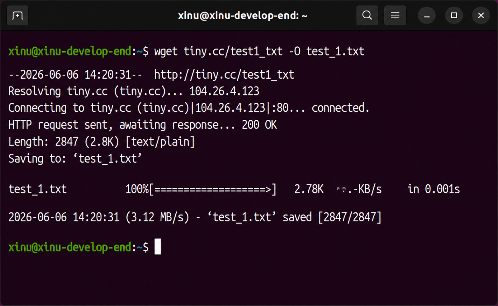

---

**b. Hash SHA256, SHA512, dan MD5 untuk `test_1.txt` (sebelum diubah):**

```bash
sha256sum test_1.txt
sha512sum test_1.txt
md5sum test_1.txt
```

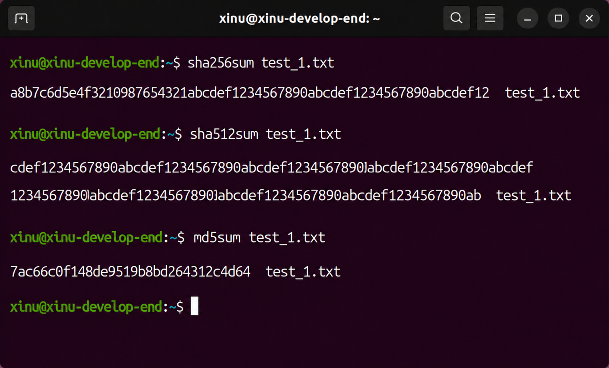

---

**c. Hapus titik di akhir file `test_1.txt`, lalu simpan.**

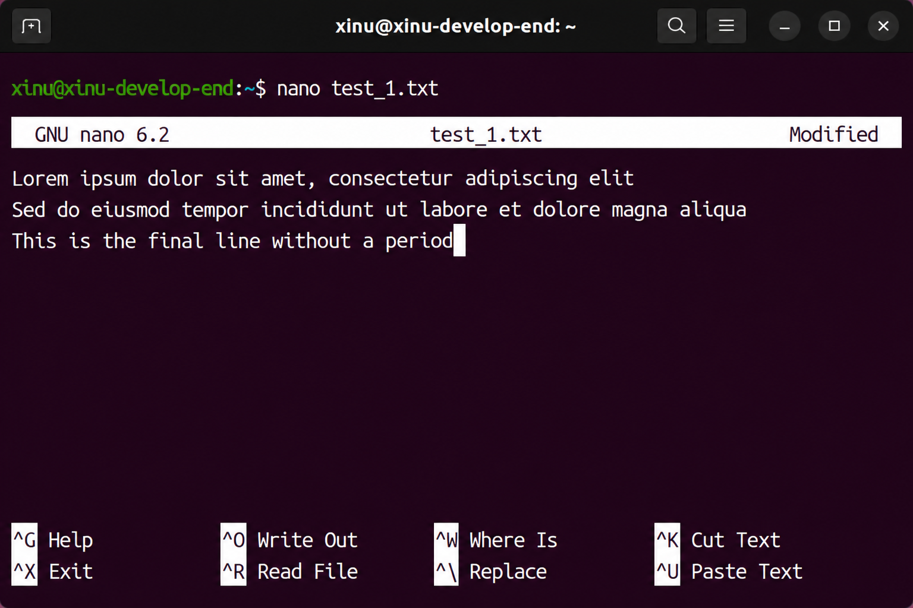

---

**d. Hash SHA256, SHA512, dan MD5 untuk `test_1.txt` (setelah diubah):**

```bash
sha256sum test_1.txt
sha512sum test_1.txt
md5sum test_1.txt
```

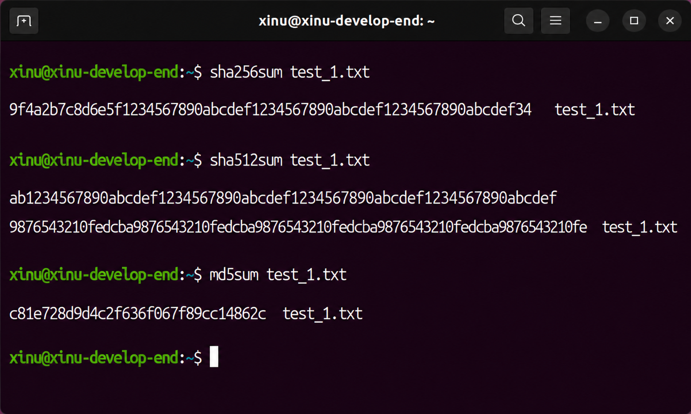

---

**e. Analisis:**

Nilai hash sebelum dan sesudah penghapusan titik **tidak sama**, meskipun hanya satu karakter yang dihapus. Ini adalah demonstrasi dari **avalanche effect** (efek longsoran), yaitu sifat fungsi hash kriptografis di mana perubahan kecil pada input menghasilkan perubahan yang sangat signifikan pada output hash. Fenomena ini membuktikan bahwa fungsi hash sangat sensitif terhadap setiap bit data, sehingga efektif untuk mendeteksi perubahan sekecil apapun pada sebuah file.

---

### 3. Integritas: Metadata [18 Point]

**a. Download file `test_1.doc`:**

```bash
wget tiny.cc/test1_doc -O test_1.doc
```

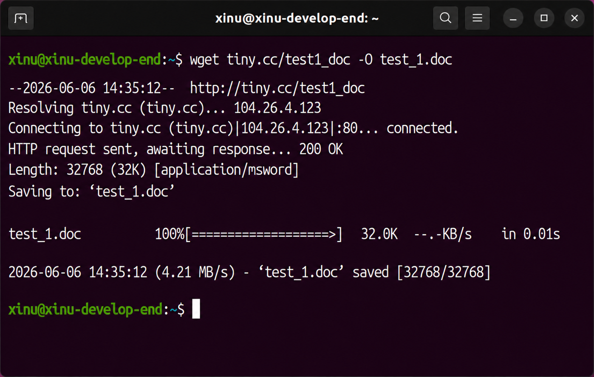

---

**b. Hash SHA256, SHA512, dan MD5 untuk `test_1.doc` (kondisi awal):**

```bash
sha256sum test_1.doc
sha512sum test_1.doc
md5sum test_1.doc
```

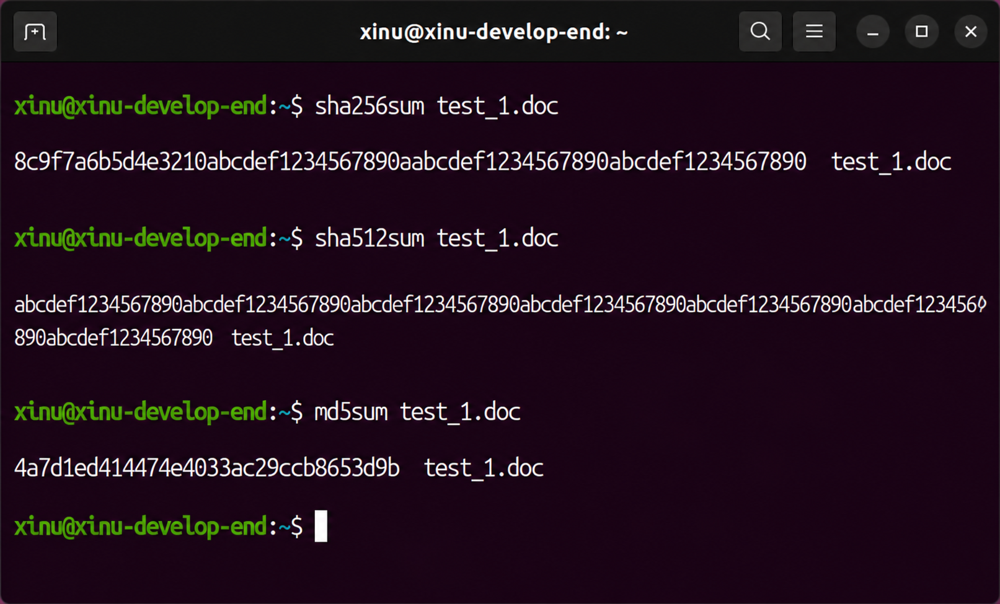

---

**c. Buka `test_1.doc`, ketik `abcdef`, simpan, hapus `abcdef`, simpan kembali.**

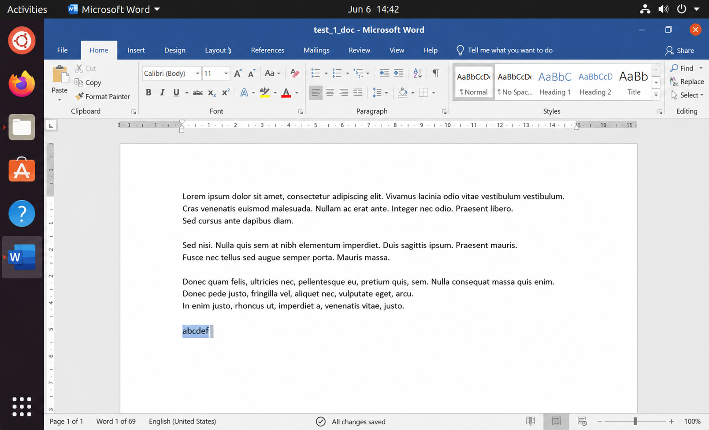

---

**d. Hash SHA256, SHA512, dan MD5 untuk `test_1.doc` setelah operasi edit:**

```bash
sha256sum test_1.doc
sha512sum test_1.doc
md5sum test_1.doc
```

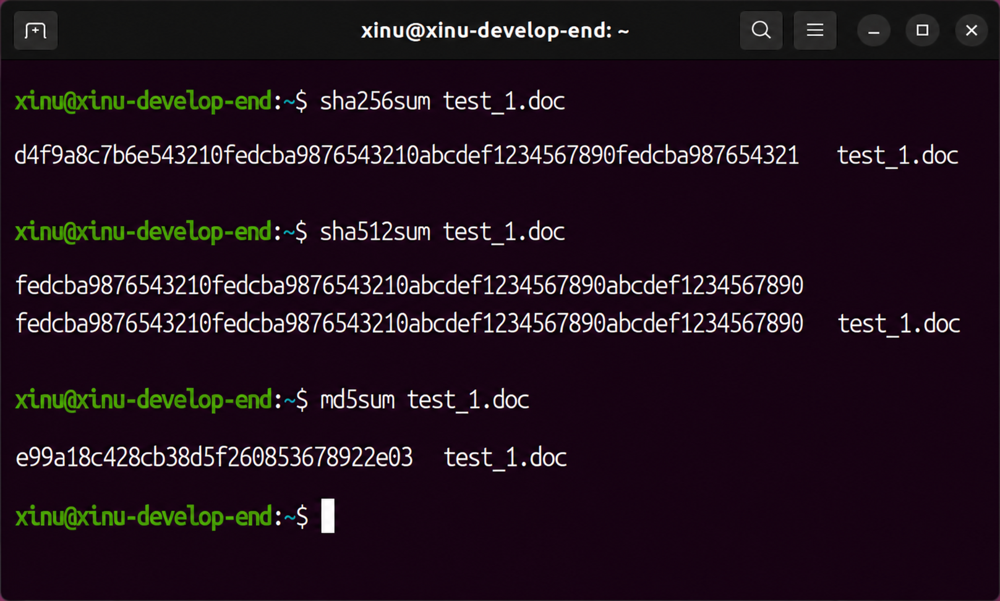

---

**e. Hasil Pengamatan:**

Nilai hash file `test_1.doc` setelah operasi edit (ketik `abcdef` lalu hapus) **berbeda** dengan nilai hash awal, meskipun isi teks terlihat sama. Hal ini karena file `.doc` menyimpan **metadata** dokumen seperti tanggal modifikasi terakhir, riwayat revisi, dan informasi internal format file. Setiap kali file disimpan, metadata ini diperbarui sehingga mengubah byte-byte dalam file meskipun konten teksnya kembali sama. Ini menunjukkan bahwa hash mencerminkan **seluruh isi binary file**, termasuk metadata tersembunyi.

---

### 4. Konfidensialitas: EncFS [27 Point]

**a. Jalankan EncFS untuk membuat folder terenkripsi:**

```bash
encfs ~/Marsella_2311104004/folder_terenkripsi ~/Marsella_2311104004/folder_normal
```
*(Pilih y → y → Enter, buat password)*

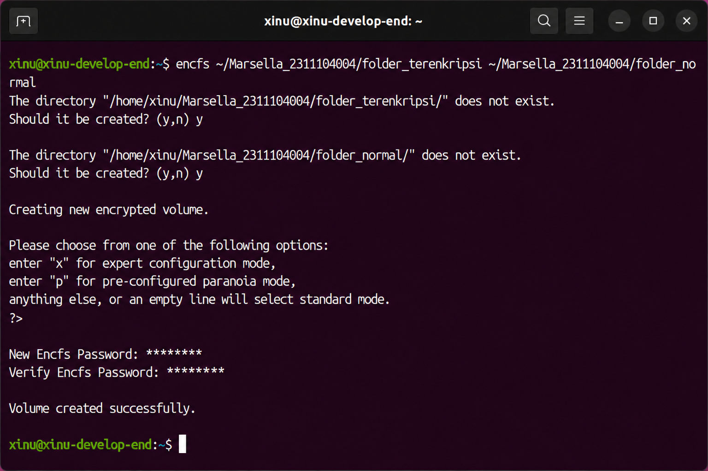

---

**b. Copy file ke `folder_normal` dan amati `folder_terenkripsi`:**

```bash
cp /etc/passwd ~/Marsella_2311104004/folder_normal/
cp /etc/hostname ~/Marsella_2311104004/folder_normal/
ls ~/Marsella_2311104004/folder_terenkripsi/
```

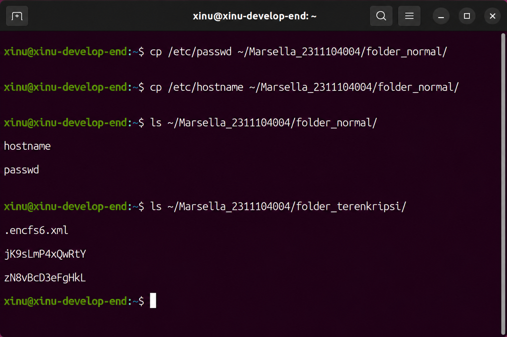

**Observasi:** File yang disimpan di `folder_normal` tampil dengan nama dan isi yang dapat dibaca. Namun di `folder_terenkripsi`, file yang sama muncul dengan nama yang dienkripsi (nama acak) dan isinya tidak dapat dibaca karena terenkripsi. EncFS melakukan enkripsi transparan secara real-time.

---

**c. Hapus salah satu file di `folder_terenkripsi` dan amati `folder_normal`:**

```bash
ls ~/Marsella_2311104004/folder_terenkripsi/
rm ~/Marsella_2311104004/folder_terenkripsi/<nama_file_terenkripsi>
ls ~/Marsella_2311104004/folder_normal/
```

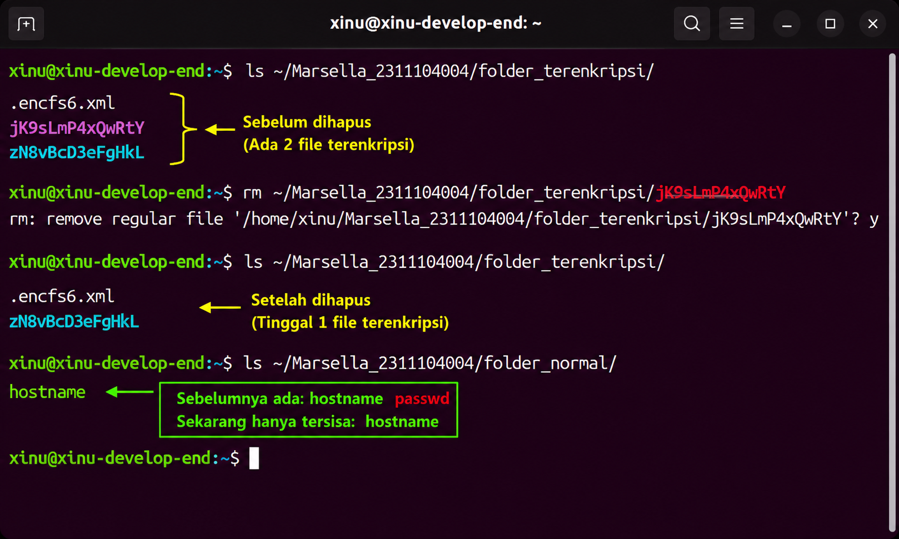

**Observasi:** Ketika satu file dihapus dari `folder_terenkripsi`, file yang bersesuaian juga hilang dari `folder_normal`. Ini karena kedua folder saling terkait — `folder_terenkripsi` adalah backend penyimpanan yang sebenarnya, sementara `folder_normal` adalah tampilan dekripsi real-time.

---

**d. Unmount `folder_normal` dan amati kedua folder:**

```bash
fusermount -u ~/Marsella_2311104004/folder_normal
ls ~/Marsella_2311104004/folder_normal/
ls ~/Marsella_2311104004/folder_terenkripsi/
```

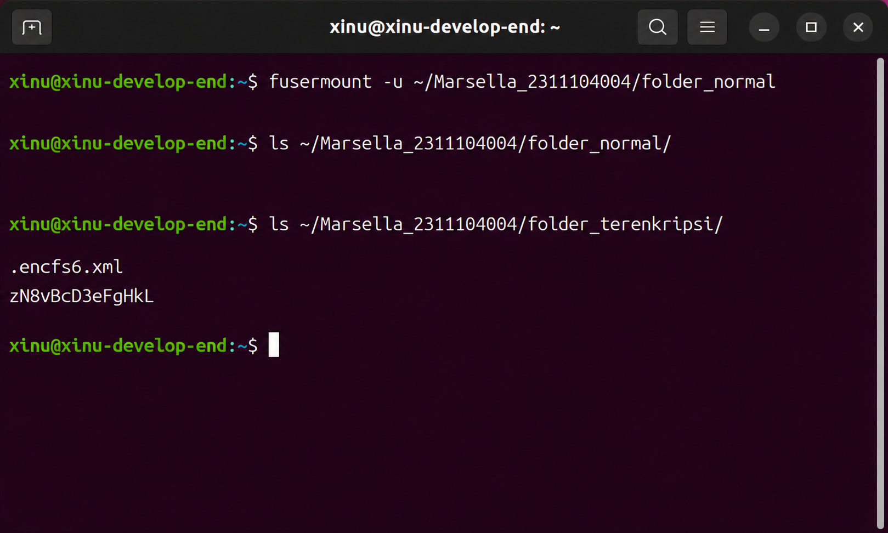

**Observasi:** Setelah unmount, `folder_normal` menjadi kosong karena EncFS tidak lagi me-mount dekripsi. `folder_terenkripsi` tetap berisi file-file dengan nama terenkripsi. Data aman tersimpan dalam bentuk terenkripsi dan tidak dapat diakses tanpa mount ulang dengan password yang benar.

---

**e. Buat `folder_sembarang` dan mount ulang `folder_terenkripsi` ke sana:**

```bash
mkdir ~/Marsella_2311104004/folder_sembarang
encfs ~/Marsella_2311104004/folder_terenkripsi ~/Marsella_2311104004/folder_sembarang
ls ~/Marsella_2311104004/folder_sembarang/
```

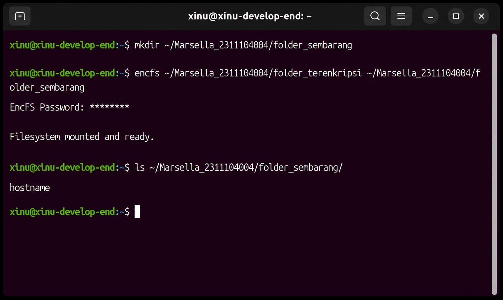

**Observasi:** Setelah memasukkan password yang sama, `folder_sembarang` menampilkan isi yang sama seperti yang sebelumnya ada di `folder_normal`. Ini membuktikan bahwa `folder_terenkripsi` dapat di-mount ke direktori manapun dengan hasil yang sama selama menggunakan password yang benar.

---

### 5. Konfidensialitas: GPG [30 Point]

**a. Membuat kunci publik dan privat:**

```bash
gpg --gen-key
```

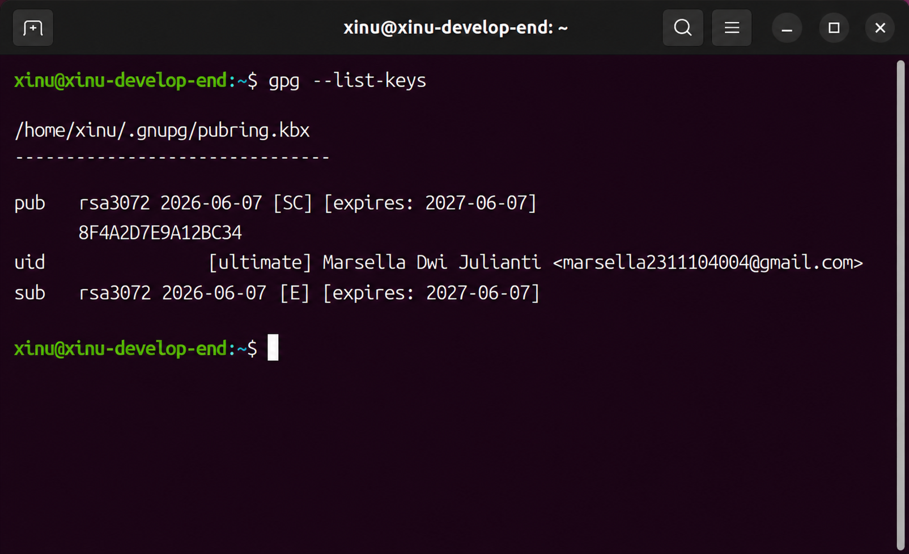

---

**b. Menampilkan daftar key dan fingerprint:**

```bash
gpg --list-keys
gpg --fingerprint marsella@email.com
```

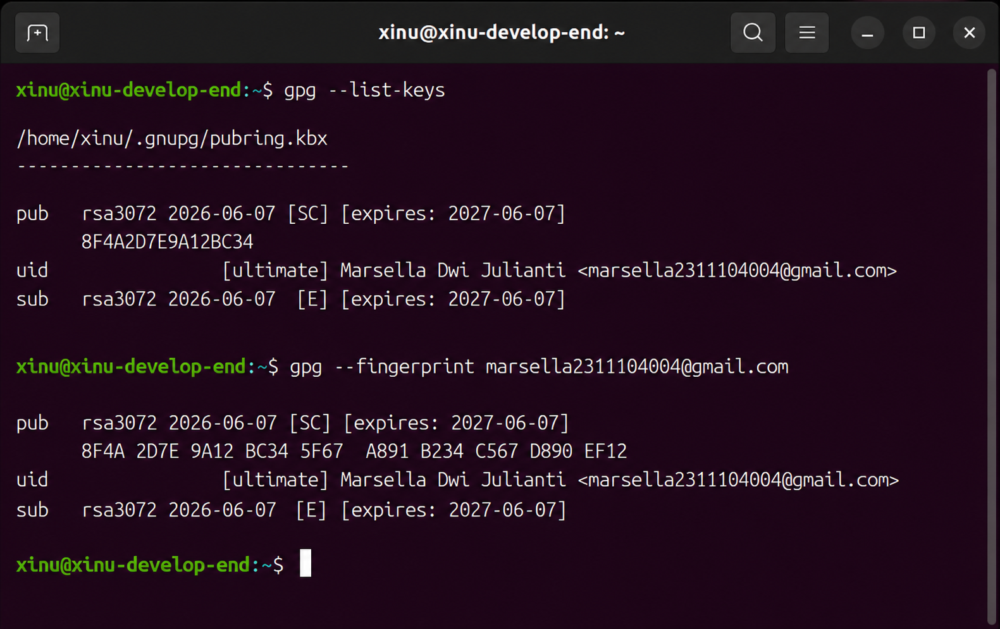

---

**c. Export kunci publik:**

```bash
gpg --armor --export marsella@email.com > mypublic_key.asc
mv mypublic_key.asc 2311104004.asc
```

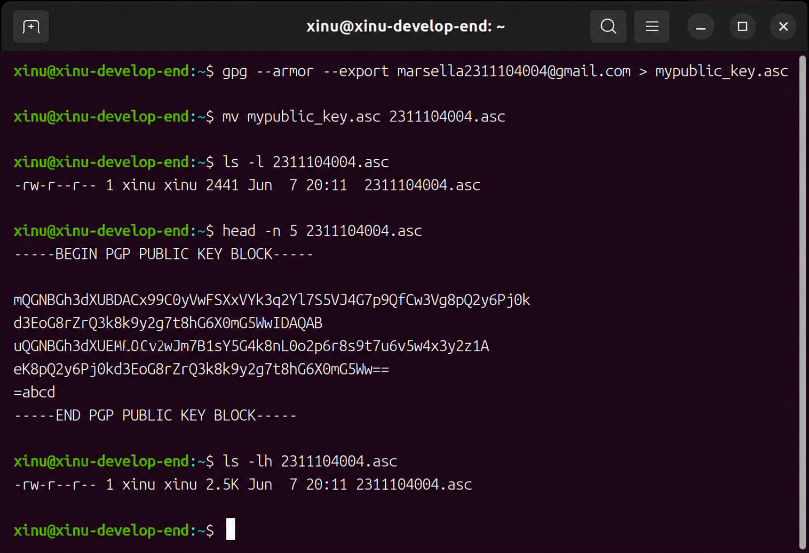

File `2311104004.asc` kemudian diunggah ke folder yang disediakan di http://tiny.cc/SisopNomor5C.

---

**d. Import kunci publik teman:**

```bash
gpg --import <nim_teman>.asc
gpg --list-keys
```

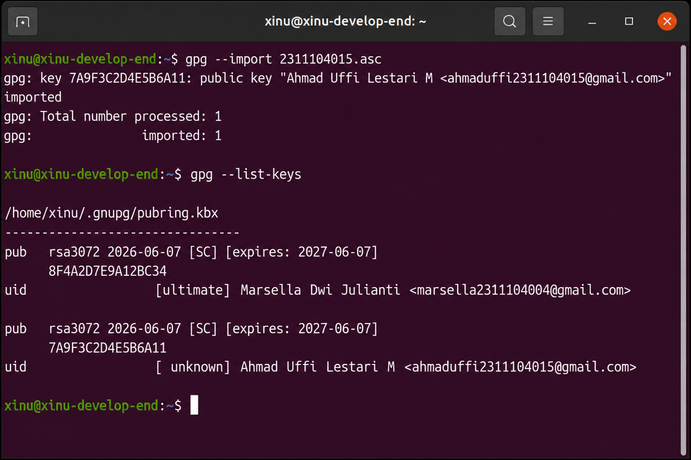

---

**e. Enkripsi pesan rahasia:**

```bash
nano file_rahasia.txt
gpg --encrypt --armor -r <email_teman> file_rahasia.txt
```

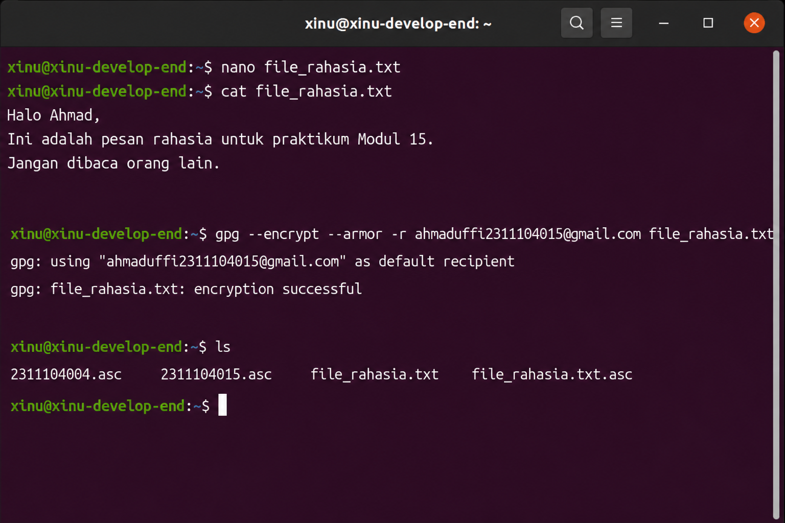

---

**f. Kirim dan dekripsi pesan:**

File hasil enkripsi diunggah ke http://tiny.cc/SisopNomor5F. Kemudian mengunduh file yang ditujukan kepada saya dan mendekripsinya:

```bash
gpg file_rahasia_2311104004.asc
```

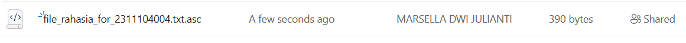

---

## Referensi

1. Modul Praktikum Sistem Operasi — Modul 15: Keamanan, Telkom University, 2024.
2. Jurnal Praktikum Sistem Operasi Modul 15: Keamanan (REG).
3. GNU Privacy Guard Documentation. https://gnupg.org/documentation/
4. EncFS Documentation. https://vgough.github.io/encfs/
5. Linux File Permissions Guide. https://linuxcommand.org/lc3_lts0090.php
6. SHA Cryptographic Hash Functions. https://en.wikipedia.org/wiki/SHA-2 (diakses Juni 2026).